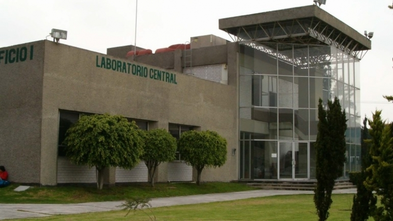
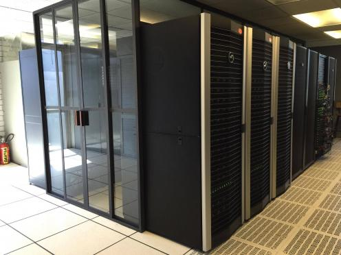
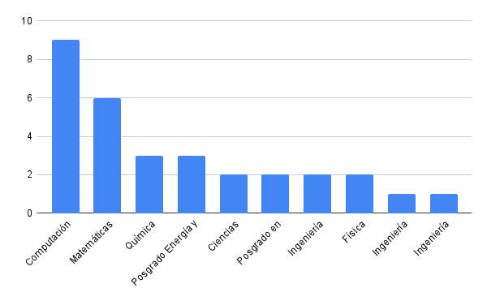

# Introducción

# Bienvenidos al Curso: Terminal GNU/LINUX Nivel cero

Algunos datos sobre este curso:

-   Esta es la cuarta edición con este formato.

-   Impartido por miembros del **Laboratorio de Supercómputo y
    Visualización en Paralelo**

El Laboratorio de Supercómputo y Visualización en Paralelo (LSVP)
inició su funcionamiento a finales de 1993.

Tiene como finalidad apoyar el trabajo de investigación
que requiere de **Cómputo científico de alto rendimiento.**

Se encuentra ubicado en el primer piso del edificio I.

En el LSVP se encuentra una de las supercomputadoras más poderosas del país:

> El cluster **Yoltla (Yoltlamaltini)**

Que significa

> **"Semillero del saber o conocimiento"**

- Yoltla usa linux
   - Se requiere linux para administrarlo
   - Se requiere linux para utilizar los recursos

- En la administración de Yoltla participan alumnos de la UAM (Miembros del LSVP)
- Se realizan actividades como:
    - Implementación de nuevos servicios.
    - Mantenimiento del cluster.
    - Optimización de aplicaciones científicas.
    - Impartición de cursos.

## Instructores para este curso

Los miembros del laboratorio que van a dar este curso

-   Diego Morales Serrano
-   Luis Fernando Torres Hernández
-   Omar Juárez Merino

## Demografía del curso

Esta es la demografía para este curso

