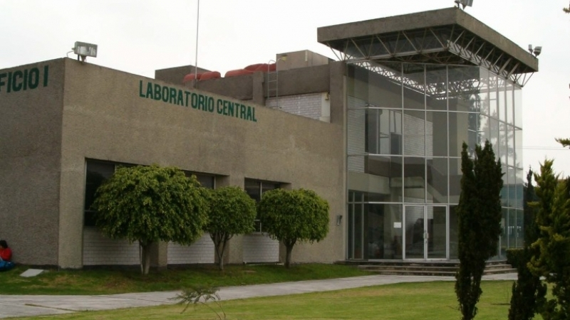
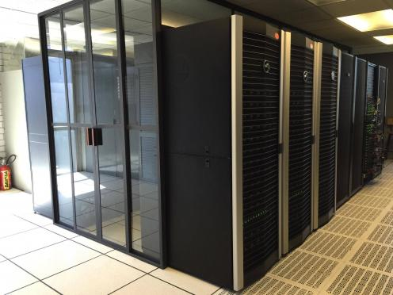

# Bienvenidos al Curso: Terminal GNU/LINUX Nivel cero

## Algunos datos sobre este curso:

-   Esta es la quinta edición (La primera en 2023).
-   La primera edición hibrida
-   Impartido por miembros del **Laboratorio de Supercómputo y
    Visualización en Paralelo**

## El Laboratorio de Supercómputo y Visualización en Paralelo (LSVP)
- Inició su funcionamiento a finales de 1993.
- El LSVP apoyar el trabajo de investigación que requiere de **Cómputo científico de alto rendimiento.**
- Se encuentra ubicado en el primer piso del edificio I.

En el LSVP se encuentra una de las supercomputadoras más poderosas del país:

> El cluster **Yoltla (Yoltlamaltini)**

- Cluster para investigación científica.
- Yoltla usa linux
   - Para administrarlo
   - Para utilizar los recursos de computo

- En la administración de Yoltla participan alumnos de la UAM (Miembros del LSVP)
- Realizan actividades como:
    - Implementación de nuevos servicios.
    - Mantenimiento del cluster.
    - Optimización de aplicaciones científicas.
    - **Impartición de cursos**.

## Instructores para este curso

Los miembros del laboratorio que van a dar este curso y a apoyar.

-   Luis Fernando Torres Hernández
-   Diego Morales Serrano
-   Omar Juárez Merino
-   Erick Ricardo Martinez Martinez

## Modalidad

- Este es un curso práctico (Se dejan ejercicios)
- Se habilitaron contenedores y una interfáz web (se mantendrá durante toda la semana)
- Esta página web estará disponible durante toda la semana.
- Hay certidficado para quien asista a todo el curso.
- Hay visita guiada  en el laboratorio de supercomputo el jueves.

