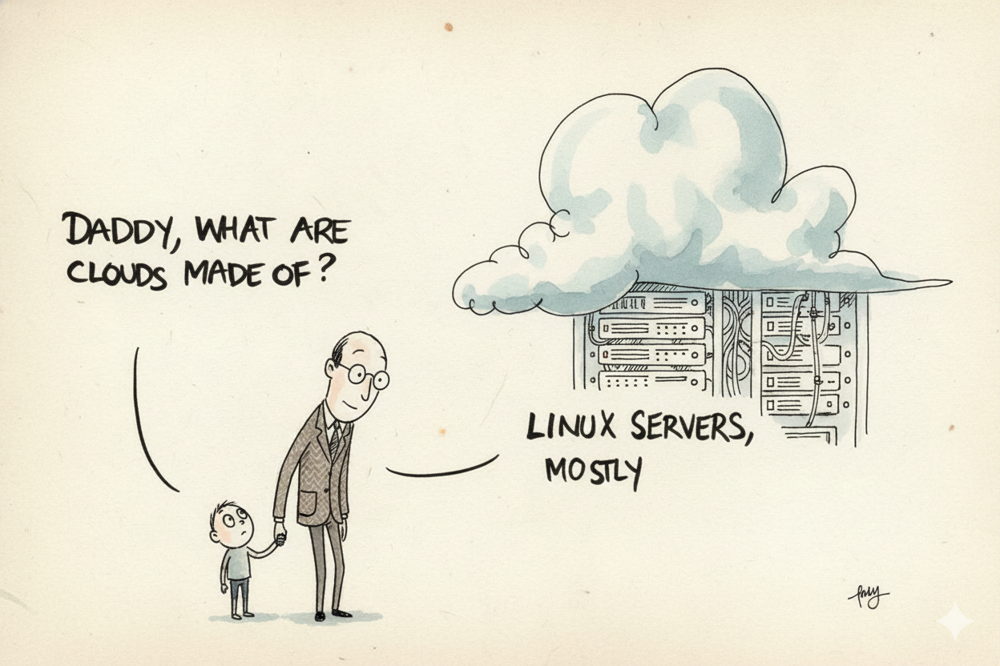
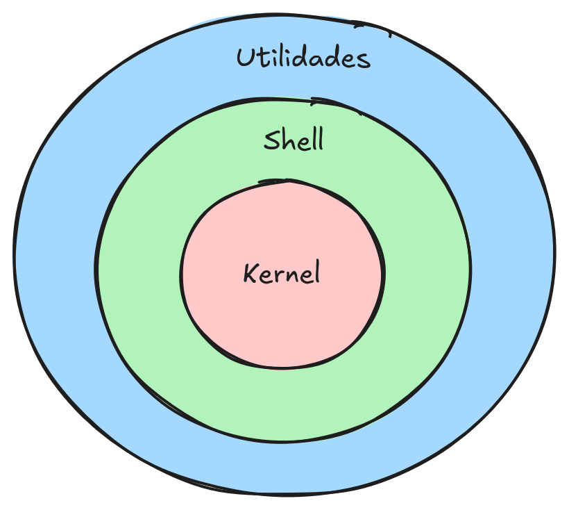
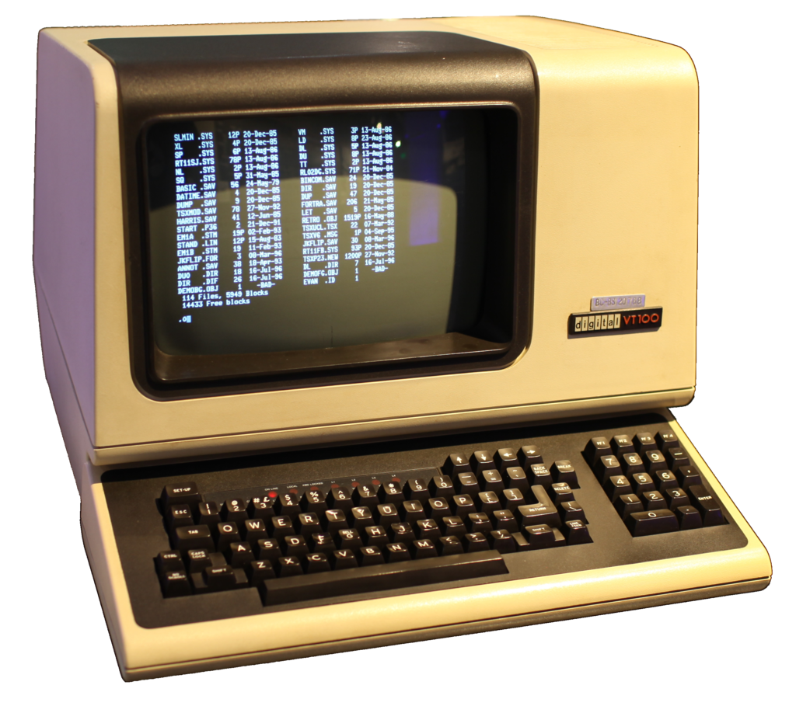
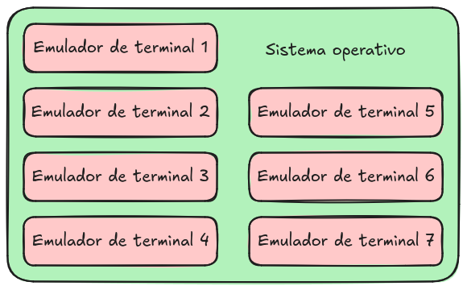
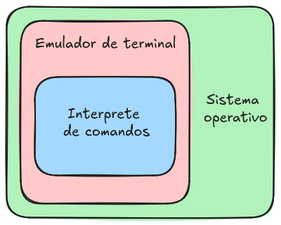
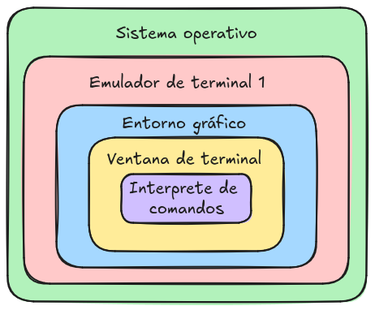

# Introducción

- ¿Quién Utiliza Linux?
- ¿Por qué aprender a usar Linux?
- ¿Por qué aprender a usar la terminal de Linux?

La palabra clave es

__**HERRAMIENTA**__

Como usamos nuestras herramientas
- Reduce el esfuerzo
- Ahorra tiempo
- Una herramienta se Cuida
- Las herramientas se personalizan
- **La herramienta adecuada para cada trabajo**


### El sistema operativo GNU/LINUX es una herramienta

**¿Qué es un sistema operativo?**

```admonish note title="posibles respuestas"
-   Una colección de aplicaciones que hacen que una computadora sea más
    simple y comprensible
-   Un software que controla los recursos de la computadora:
    -   Memoria
    -   Elementos que procesan
    -   Dispositivos conectados

```

### Algunas características del SO GNU/LINUX

***Es de código abierto y gratuito***
- Se puede aprender del código fuente, se puede modificar [ src ](https://github.com/torvalds/linux)
- Es un esfuerzo colectivo (más de 25,000 personas) [ estadísticas ]( https://insights.linuxfoundation.org/project/korg/contributors?timeRange=past365days&start=2025-01-08&end=2026-01-08 )
- Sujeto al escrutinio (importante para la libertad seguridad).

***Multiplataforma*** \
Funciona en muchos dispositivos:
- Computadoras personales
- [ Servidores ]( https://top500.org/statistics/list/ )
- Smartphones
- Sistemas pequeños
- Consolas de videojuegos



***Estabilidad y seguridad*** \
De acuerdo al uso que se le quiera dar

***Personalizable*** \
- Es modular
- Se adapta para distintos tipos de uso

***Tiene una estrecha relación con las universidades y el software científico***\
Para uso académico

Personalmente
- Lo que me gusta
   - Está hecho para humanos
   - Fácil comprensión de la estructura general
   - Uno tiene el control
   - Tus programas viven [ mejor ]( ./images/introduccion/holapy.png )
- Lo que no me gusta
   - Poco soporte por parte de algunos desarrolladores
   - Relación amor/odio con software privativo
   - Actualizaciones que rompen el sistema

### ¿Qué significa aprender a utilizar el SO GNU/Linux?

```admonish note title="De acuerdo al uso que se le da"
- Uso General
   - Navegar en Internet
   - Visualizar archivos multimedia
   - Editar archivos de office

- Uso académico o profesional
   - Instalar y usar aplicaciones de software libre
   - Aplicaciones científicas
   - Aplicaciones de desarrollo de software
   - Aplicaciones de producción multimedia

- El SO GNU/linux como camino profesional
   - Administrar la infraestructura de un centro de datos
   - Administrar clusters de supercómputo
   - Administrar instancias de computo en la nube
   - Administrar infraestructura para desarrollo de software
```

### Formas de interactuar con el SO
-   Interfaz gráfica de usuario (GUI)
-   Interfaz por linea de comandos (CLI)

> En un sistema GNU/Linux la forma principal de interacción es por linea de comandos.
    La forma secundaria es por interfaces gráficas.

> Los elementos clave para aprender linux es
> - Sistema de archivos
> - texto

### Algunos conceptos importantes (Para fistas y leer documentación)

#### Kernel


#### Terminal


Uso original de las terminales


#### Emulador de terminal



#### Ventana de terminal


##### Ejemploes
- [ kitty ]( https://sw.kovidgoyal.net/kitty/ )
- [ warp ]( https://www.warp.dev/ )
- [ gnome ]( https://help.gnome.org/gnome-terminal/ )


#### Interprete de comandos
    Es un programa que "Te pregunta qué quieres hacer"

- Interprete de comandos (Shell)
   - sh
   - **Bash**
   - tcsh
   - zsh
   - fish

#### Distribución (Distro)
[Distrowatch](https://distrowatch.com/)

```admonish note title="En resumen"
- El kernel se encarga de...
- ¿Trabajamos con terminales reales?
- ¿Qué nos permite hacer una terminal sin interprete de comandos?
- ¿Qué nos permite hacer una terminal con todo e interprete?
```

## **Breve** historia del SO GNU/linux
- Multics (1964)
- Unix (1969) [video](https://youtu.be/tc4ROCJYbm0?si=UrFYmddijFfNnqWp)
- GNU (1984) [video](https://youtu.be/sPrJvwIPW3M?si=Rl6O14DIDZaxZ2F6)
- LINUX (1991) [Video](https://youtu.be/o8NPllzkFhE?si=EM5mUD02O3EYJsWT)
- GNU/LINUX (1992)

```admonish note title="En resumen"
- UNIX fue desarrollado por... 
- GNU/Linux surge a partir de...
- GNU/Linux se usa en...
```
