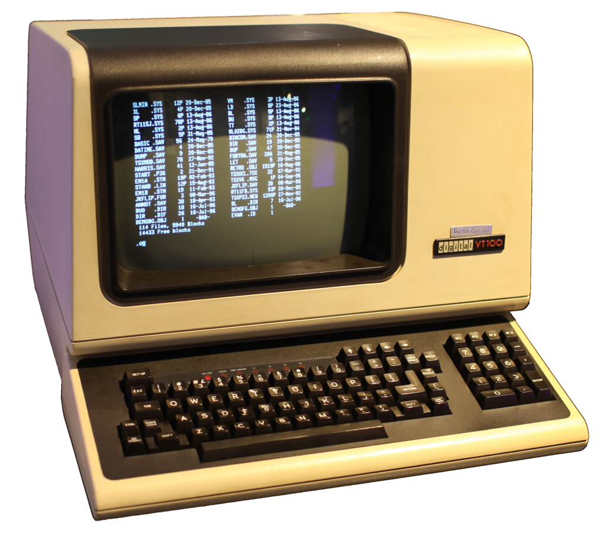
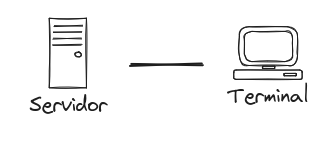
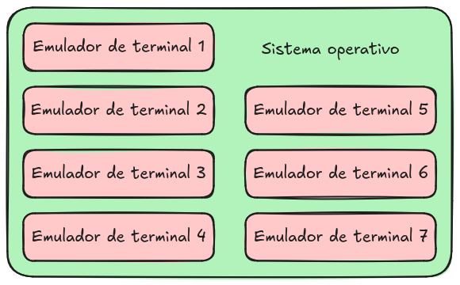
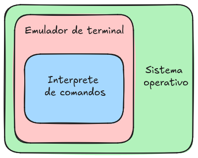
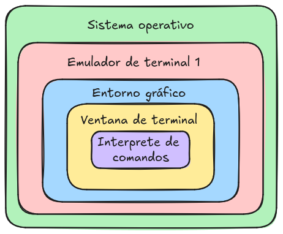
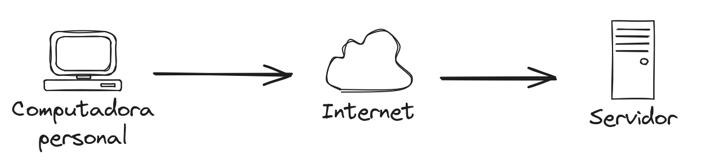
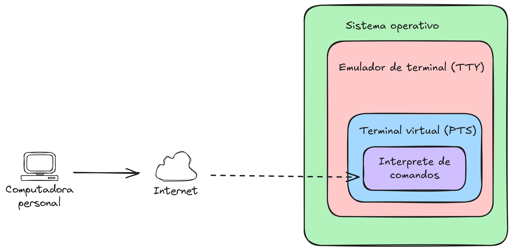

# Introducción

La palabra clave es

__**HERRAMIENTA**__

Ideas relacionadas con herramientas:
- La herramienta adecuada para cada trabajo.
- Perfeccionamiento de habilidades.
- Cuidados.
- Personalizable.

### El sistema operativo GNU/LINUX es una herramienta

**¿Qué es un sistema operativo?**

```admonish note title="posibles respuestas"
-   Un software que controla los recursos de la computadora:

    -   La memoria de la computadora
    -   los elementos que hacen procesamiento
    -   los dispositivos conectados a la computadora

-   Una colección de aplicaciones que hacen que una computadora sea más
    simple y comprensible para los programadores o usuarios.
```

### Algunas características del SO GNU/LINUX

... Y por qué les puede resultar útil aprender a usar esta herramienta.

***Es de código abierto y gratuito*** \
Se puede aprender del código fuente, se puede modificar,
   sujeto al escrutinio (importante para la libertad).

***Multiplataforma*** \
Funciona en muchos dispositivos:
- Computadoras personales
- Servidores
- Smartphones
- Computadores de una placa
- Consolas de videojuegos

***Estabilidad y seguridad*** \
...Con sus respectivas condiciones.

***Personalizable*** \
Para distintos tipos de uso.

***Tiene una estrecha relación con las universidades y el software científico***\
Para su desarrollo profesional.

Personalmente
- Lo que me gusta
   - Está hecho para humanos.
   - Fácil comprensión de la estructura.
   - Uno tiene el control.
   - Sin antivirus.
- Lo que no me gusta
   - Poco soporte por parte de algunos desarrolladores
   - Relación amor/odio con software privativo.
   - Actualizaciones que rompen el sistema.

### ¿Qué significa aprender a utilizar el SO GNU/Linux?

```admonish note title="De acuerdo al uso que se le da"
- Uso General
   - Navegar en Internet
   - Visualizar archivos multimedia
   - Editar archivos de office

- Uso académico o profesional
   - Instalar y usar aplicaciones de software libre
   - Aplicaciones científicas.
   - Aplicaciones de desarrollo de software.
   - Aplicaciones de producción multimedia.

- El SO GNU/linux como camino profesional
   - Administrar instancias de computo en la nube.
   - Administrar infraestructura para desarrollo de software.
   - Administrar clusters de supercómputo.
```

### Formas de interactuar con el SO
-   Interfaz gráfica de usuario (GUI)
-   Interfaz por linea de comandos (CLI)

> En un sistema GNU/Linux la forma principal de interacción es por linea de comandos.


### Algunos conceptos importantes

#### Terminal


Uso original de las terminales


#### Emulador de terminal



#### Ventana de terminal


#### Interprete de comandos

- Interprete de comandos (Shell)
   - sh
   - **Bash**
   - tcsh
   - kornsh
   - zsh
   - fish

#### Conexión remota
##### ssh (secure shell)



### Para empezar

Conexión remota
```
    ssh usuario@direccion
```
