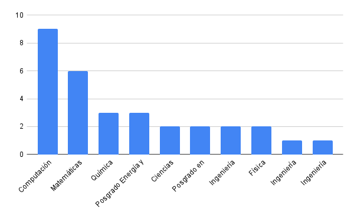

# Introducción

# Bienvenidos al Curso terminal GNU/LINUX Nivel cero

Algunos datos sobre este curso:

-   Esta es la tercera edición con este formato.

-   Impartido por miembros del **Laboratorio de Supercómputo y
    Visualización en Paralelo**

>El Laboratorio de Supercómputo y Visualización en Paralelo (LSVP) de la
>División de Ciencias Básicas e Ingeniería (DCBI) de la Universidad
>Autónoma Metropolitana Unidad Iztapalapa (UAM-I), inició su
>funcionamiento a finales de 1993.
>
>El Laboratorio tiene como finalidad apoyar el trabajo de investigación
>que requiere de cómputo científico de alto rendimiento en - Física - Química - >
>Matemáticas - ingeniería
>
>

>El núcleo del laboratorio es el cluster **Yoltla (Yoltlamaltini)** 
>Cuyo nombre 
>
>significa ***"semillero del saber o conocimiento"***
>
>

-   El cluster Yoltla Está hecho con linux

    -   Se requiere linux para administrarlo
    -   Se requiere linux para utilizar los recursos

-   Parte de la administración y mantenimiento del laboratorio se
    realiza por alumnos de licenciatura.

-   Se realizan actividades como

    -   Implementación de nuevos servicios
    -   Mantenimientos preventivos
    -   Optimización de aplicaciones científicas
    -   Se imparten cursos

## Instructores para este curso {#_instructores_para_este_curso}

Los miembros del laboratorio que van a dar este curso

-   Daniella Librado Serrano
-   Diego Morales Serrano
-   Eduardo Morgado Velázquez
-   Luis Fernando Torres Hernández
-   Omar Juárez Merino

## Demografía del curso {#_demografía_del_curso}

Esta es la demografía para este curso



## Introducción {#_introducción}

La palabra clave es

**HERRAMIENTA**

<!--:   [HERRAMIENTA]{..underline}-->

Piensen en la relación que tienen con su herramientas

-   Cuidados
-   Perfeccionamiento de habilidades
-   Personalización

### El sistema operativo GNU/LINUX es una herramienta {#_el_sistema_operativo_gnu_linux_es_una_herramienta}

**¿Qué es un sistema operativo?**

```admonish note title="posibles respuestas"
-   Un software que controla los recursos de la computadora:

    -   La memoria de la computadora
    -   los elementos que hacen procesamiento
    -   los dispositivos conectados a la computadora

-   Una colección de aplicaciones que hacen que una computadora sea más
    simple y comprensible para los programadores o usuarios.
```

### Algunas características del SO GNU/LINUX {#_algunas_características_del_so_gnu_linux}

Y por qué les puede resultar útil aprender a usar esta herramienta.

***Es eficiente y versátil*** \
Útil para cualquier equipo de computo

***Es consistente*** \
Fácil de aprender.

***Es un desarrollo de software libre y código abierto*** \
Importante para su libertad

***Tiene una estrecha relación con las universidades y el software científico***\
Para su desarrollo profesional

### ¿Qué significa aprender a utilizar el SO GNU/Linux? {#_qué_significa_aprender_a_utilizar_el_so_gnu_linux}

```admonish note title="De acuerdo al uso que se le da"
-   Uso General

    -   Navegar en Internet
    -   Visualizar archivos multimedia
    -   Editar archivos de office

-   Uso académico o profesional

    -   Instalar y usar aplicaciones de software libre
    -   Aplicaciones científicas.
    -   Aplicaciones de desarrollo de software.
    -   Aplicaciones de producción multimedia.

-   El SO linux como camino profesional

    -   Administrar instancias de computo en la nube.
    -   Administrar infraestructura para desarrollo de software.
    -   Administrar clusters de supercómputo.
```

### Formas de interactuar con el SO {#_formas_de_interactuar_con_el_so}

-   Interfaz gráfica de usuario (GUI)
-   Interfaz por linea de comandos (CLI)

### Algunos conceptos importantes {#_algunos_conceptos_importantes}


-   Terminal

    -   Emulador de terminal
    -   Ventana de terminal

-   Interprete de comandos (Shell)

    -   sh
    -   **Bash**
    -   tcsh
    -   kornsh
    -   zsh
    -   fish

### Para empezar {#_para_empezar}

Conexión remota 
```
    ssh usuario@direccion
```
