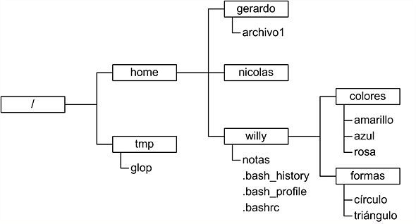

# Sistema de Archivos UNIX
## ¿Qué es un sistema de archivos?
> Un sistema de archivos es una estructura de datos que organiza la información
> en un dispositivo de almacenamiento, como un disco duro. Transforma bloques
> de datos en una jerarquía de directorios y archivos, facilitando su acceso y gestión.


El propósito básico de un sistema de archivos es:
> - Organizar los recursos de almacenamiento.
> - Organizar los **archivos**.


### Un sistema de archivos virtual para dominarlos a todos...
El Sistema de archivos virtual (VFS) es la capa de abstracción que permite que
todas las implementaciones de sistemas de archivos mantengan una única interfaz de usuario.

## Todo es un archivo

```admonish info title="Participación"
**¿Cúales de las siguientes cosas esperarías encontrar en un sistema de archivos?**
- Procesos.
- Directorios.
- Dispositivos de audio.
- Canales de comunicación entre procesos.
- Estructuras de datos del kernel.
- Fotografías.
- Textos.
- Configuracion de aplicaciones.
- Secciones de la memoria RAM.
```

```admonish info title="Pista"
"En un sistema tipo UNIX, todo es un archivo."
```

> Idea que utilizan los sistemas tipo UNIX para gestionar Entrada/Salida de recursos
> como flujos de bytes expuestos  através del sistemas de archivos.

Algunas ventajas de este enfoque
1. Archivos y dispositivos de Entrada/Salida (teclado,pantalla,etc.) son tan similares como es posible.
    - Los nombres de archivo y dispositivo tienen la misma sintaxis y significado, por lo que un programa que espera un nombre de archivo como parámetro puede pasar un nombre de dispositivo.
3. Los archivos especiales están sujetos al mismo mecanismo de protección que los archivos normales.

> Conclusion:
>  **Los archivos y el sistema de archivos son centrales en la filosofía UNIX**


## Componentes de un sistema de archivos

**Namespace**
- Una forma de nombrar las cosas y organizarlas jerárquicamente.
- Árbol de archivos [Árbol de archivos](#Árbol-de-archivos)
y [pathname](#pathname)

**API**
- Un conjunto de llamadas al sistema para navegación y manipulación de objetos.
- **Comandos de navegación y manipulación de archivo.**
- `Universal I/O Model (stdio.h)`

**Modelo de seguridad**
- Un modelo para proteger, esconder y compartir cosas.
- **Esquema de permisos.**

**Implementación**
- Software para unir el modelo al hardware.
- **Drivers o módulos del kernel.**

```admonish info title="Participación"
- ¿Qué sistemas de archivos conoces?
- ¿En qué contextos es importante un esquema de permisos?
```

### Árbol de archivos

En Linux se mantiene una **única estructura de directorios
jerárquica** para organizar **todos los archivos del sistema.**

```admonish info title="Participación"
- ¿Qué diferencia tiene la estructura del sistema de archivos UNIX con la de otros sistemas operativos?
```

#### Archivos
Conjunto de datos con un nombre asociado.

#### Directorios
Tipo de archivo especial cuyo contenido toma la forma de una tabla
con nombres de archivos asociados al archivo correspondiente.

### 
- EL **nombre de archivo con referncia** se le llama **link**
- Cada archivo puede tener multiples links (muchos nombres)
- Un directorio puede tener links a archivos o a directorios.
- Los links a directorios establecen una jerarquia (Padres e hijos)

- Cada directorio tiene al menos dos entradas
    - . (punto): link al mismo directorio
    - .. (punto-punto): link a su directorio padre

### Pathname

- Estructura jerárquica de varios niveles
- En la parte superior del sistema de archivos hay un directorio llamado
\"raíz\" que se representa con \"/\".
- Todos los demás archivos son \"descendientes\" de la raíz.



***Figura 2. Representación de un pathname.***

- la referencia a un archivo/directorio debe ser hecha a través de su **pathname**. 

La lista de directorios que se deben recorrer para localizar un archivo en 
particular más el nombre de ese archivo forman un pathname o ruta.

Por ejemplo:

```
    /directorio1/directorio2/.../directorioN/archivo
```

#### Ruta absoluta {#_ruta_absoluta}

Especifica la ruta completa desde el directorio raíz hasta el archivo o
directorio. Comienza con una barra inclinada ('/').

```
    /home/willy/notas
```

```admonish info title="Participación"
- ¿Cuál es la ruta absoluta al archivo glob?
```
```admonish info title="Participación"
- ¿Cuál es la ruta absoluta al archivo triangulo?
```
```admonish info title="Participación"
- ¿Cuál es la ruta absoluta al archivo .bashrc?
```

#### Ruta relativa {#_ruta_relativa}

- Especifica la ruta desde el directorio de trabajo actual.
- No comienza con una barra inclinada ('/').

Por ejemplo desde el directorio home
```
    willy/notas
```

```admonish info title="Participación"
- ¿Cuál es la ruta relativa del archivo glop, si estoy en el directorio "/"?
```

```admonish info title="Participación"
- ¿Cuál es la ruta relativa del archivo notas, si estoy en el directorio home?
```

```admonish info title="Participación"
- ¿Cuál es la ruta relativa del archivo archivo1, si estoy en el directorio colores?
```

```admonish info title="Participación"
- ¿Cuál es la ruta relativa del directorio home, si estoy en el directorio formas?
```


#### Caracteres especiales para escribir rutas
|Símbolo   |Descripción   |
|---|---|
| /  |Hace referencia al directorio raíz y a la separación entre directorios   |
| .  |Hace referencia al directorio actual   |
| ..  | Hace referencia al directorio padre del directorio actual  |


# Tipos de Archivos {#_tipos_de_archivos}

Se contienen varios tipos de archivos:

-   *Archivos ordinarios:* Un archivo ordinario es un archivo en el
    sistema que contiene datos, texto o instrucciones de programa.

-   *Directorios:* Archivos que son listas de otros archivos.

-   *dispositivos de bloque o caracter:* Se utilizan para representar un dispositivo
    físico real, como una impresora.

-   *Pipes (Tuberías):* UNIX le permite vincular comandos mediante una
    tubería. La tubería actúa como un archivo temporal que solo existe
    para contener datos de un comando hasta que los lea otro.

-   *Sockets:* Es un archivo especial que permite una comunicación
    avanzada entre procesos.

-   *Enlace simbólico:* El enlace simbólico se utiliza para hacer
    referencia a algún otro archivo del sistema de archivos.

- *Archivos ordinarios*: Series de bytes, Pueden contener datos, texto o instrucciones de programa.
- *Directorios*: Contienen referencias a otros archivos (nombres de archivos)
- *Enlace simbólico*: Distintas rutas para un mismo archivo de forma relativa.
- Enlace duro: Distintas rutas para un mismo archivo de forma absoluta.
- Dispositivos de bloque y caracter: Representan un dispositivo físico real, como una impresora
- Pipes (Tuberías): para vincular comandos. La tubería actúa como un archivo temporal que solo existe para contener datos de un comando hasta que los lea otro.
- Sockets: permite una comunicación limpia entre procesos, incluso procesos ejecutándose en otras computadoras.

# Árbol del sistema

***Figura 1. Representación de una árbol de archivos.***

| **Directorio** | **Descripción** |
|:--------------:|:----------------|
| /  | El directorio raíz (/) es el directorio principal.
| /bin (binarios)   | Contiene archivos ejecutables (programas) que son esenciales para el funcionamiento del sistema, y que son necesarios para el arranque del sistema.
| /boot (arranque)  | Contiene archivos necesarios para el proceso de arranque del sistema, como el kernel y los archivos de configuración del gestor de arranque.
| /dev (dispositivos)| Contiene archivos especiales que representan dispositivos del sistema, como discos, particiones y periféricos.
| /etc (configuración) | Almacena archivos de configuración del sistema y de las aplicaciones instaladas en el sistema.
| /home (hogar)     | Es el directorio principal de los usuarios regulares. Cada usuario tiene un subdirectorio en /home con su nombre de usuario donde pueden almacenar sus archivos personales.
| /lib (bibliotecas) | Contiene bibliotecas compartidas necesarias para la ejecución de programas del sistema y usuario.
| /mnt (montaje)    | Se utiliza para montar sistemas de archivos adicionales o dispositivos de almacenamiento temporalmente.
| /proc (proceso) | Proporciona información en tiempo real sobre los procesos en ejecución y otros detalles del sistema.
| /root     | El directorio hogar del usuario "root", que es el superusuario o administrador del sistema.
| /bin (binarios del sistema) | Contiene archivos ejecutables esenciales para la administración del sistema, generalmente utilizados por el superusuario.
| /tmp (temporal)   | Directorio utilizado para almacenar archivos temporales.
| /usr (usuario)    | Contiene archivos y programas utilizados por usuarios, incluyendo binarios, bibliotecas y documentos.
| /usr/bin  | Contiene información de instalaciones locales.
| /usr/lib  | Almacena las bibliotecas y los archivos de datos necesarios para los programas almacenados en /usr o en otro lugar.
| /var (variable)   | Almacena datos variables, como registros de sistemas y archivos de bases de datos, logs del sistema.


```admonish info title="Participación"
- Si acabo de instalar un servidor web en mi computadora y quiero modificarle una configuración ¿A qué directorio debo ir?
```
```admonish info title="Participación"
- Si no estoy seguro de haber instalado un nuevo kernel en mi computadora ¿A qué directorio debo ir?
```
```admonish info title="Participación"
- Si quiero crear un archivo pero deseo que este archivo se borre automáticamente después ¿En qué directorio debo crearlo?
```
```admonish info title="Participación"
- Si mi hermano y yo tenemos cuenta en la misma computadora y me quiere mostrar un video que acaba de descargar ¿En qué directorio debería buscar?
```
