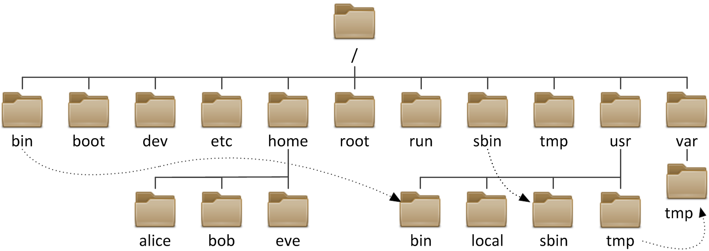

# Sistemas de archivos

Un sistema de archivos es una estructura y conjunto de reglas utilizadas
por un sistema operativo para organizar y almacenar datos en
dispositivos de almacenamiento de cómputo. El sistema de archivos define
cómo se almacenan, nombran, acceden y gestionan los archivos y
directorios en un dispositivo de almacenamiento.

**Ejemplos.**

-   exFAT

-   Ext4

-   XFS

## Filosofía Unix {#_filosofía_unix}

"Everything is a file" (Todo es un archivo) describe una de las
principales características de Unix y sus derivados.

Un **archivo normal** se puede definir como un conjunto de datos con un
nombre asociado. Los archivos suelen residir en dispositivos de
almacenamiento secundario tales como cintas, discos duros o discos
flexibles. Estos archivo no son más que una secuencia de bytes (8 bits).

## ¿Por qué todo es un archivo en Sistema tipo Unix?{#_por_qué_todo_es_un_archivo_en_sistema_tipo_unix}

Hay tres ventajas principales en el enfoque de \"todo es un archivo\":

-   1\. Archivos y dispositivos de Entrada/Salida (teclado,pantalla,
    etc.) son tan similares como es posible.

-   2\. Los nombres de archivo y dispositivo tienen la misma sintaxis y
    significado, por lo que un programa que espera un nombre de archivo
    como parámetro puede pasar un nombre de dispositivo.

-   3\. Los archivos especiales están sujetos al mismo mecanismo de
    protección que los archivos normales.

En Unix los archivos están organizados en los que se conoce como
*directorios*. Un *directorio* no es más que un archivo especial, el
cual contiene información que permite localizar en el dispositivo otros
archivos. Los directorios pueden contener a su vez nuevos directorios,
los cuales se denominan subdirectorios.


***Figura 1. Representación de una árbol de archivos.***

| **Directorio** | **Descripción** |
|:--------------:|:----------------|
| /  | El directorio raíz (/) es el directorio principal en un sistema de archivos de tipo Unix.
| /bin (binarios)   | Contiene archivos ejecutables (programas) que son esenciales para el funcionamiento del sistema, y que son necesarios para el arranque del sistema.
| /boot (arranque)  | Contiene archivos necesarios para el proceso de arranque del sistema, como el kernel y los archivos de configuración del gestor de arranque.
| /dev (dispositivos)| Contiene archivos especiales que representan dispositivos del sistema, como discos, particiones y periféricos.
| /etc (configuración) | Almacena archivos de configuración del sistema y de las aplicaciones instaladas en el sistema.
| /home (hogar)     | Es el directorio principal de los usuarios regulares. Cada usuario tiene un subdirectorio en /home con su nombre de usuario donde pueden almacenar sus archivos personales.
| /lib (bibliotecas) | Contiene bibliotecas compartidas necesarias para la ejecución de programas del sistema y usuario.
| /mnt (montaje)    | Se utiliza para montar sistemas de archivos adicionales o dispositivos de almacenamiento temporalmente.
| /proc (proceso) | Proporciona información en tiempo real sobre los procesos en ejecución y otros detalles del sistema.
| /root     | El directorio hogar del usuario "root", que es el superusuario o administrador del sistema.
| /bin (binarios del sistema) | Contiene archivos ejecutables esenciales para la administración del sistema, generalmente utilizados por el superusuario.
| /tmp (temporal)   | Directorio utilizado para almacenar archivos temporales.
| /usr (usuario)    | Contiene archivos y programas utilizados por usuarios, incluyendo binarios, bibliotecas y documentos.
| /usr/bin  | Contiene información de instalaciones locales.
| /usr/lib  | Almacena las bibliotecas y los archivos de datos necesarios para los programas almacenados en /usr o en otro lugar.
| /var (variable)   | Almacena datos variables, como registros de sistemas y archivos de bases de datos.

## Pathname {#_pathname}

Los archivos en un sistema tipo Unix están organizados en una estructura
jerárquica de varios niveles conocida como árbol de directorios. En la
parte superior del sistema de archivos hay un directorio llamado
\"raíz\" que se representa con \"/\". Todos los demás archivos son
\"descendientes\" de la raíz.


***Figura 2. Representación de un pathname.***

Como en todo sistema de archivos de cualquier sistema operativo, la
referencia a un archivo/directorio debe ser hecha a través de su
**pathname**. Un pathname se forma de la siguiente manera:
```
    /directorio1/directorio2/.../directorioN/archivo
```

### Ruta absoluta {#_ruta_absoluta}

Especifica la ruta completa desde el directorio raíz hasta el archivo o
directorio. Comienza con una barra inclinada ('/').
```
    /home/Ana/Documentos/Materia/ejemplo.txt
```

### Ruta relativa {#_ruta_relativa}

Especifica la ruta desde el directorio de trabajo actual.\
No comienza con una barra 
inclinada ('/').
```
    Documentos/Materia/ejemplo.txt
```

## Tipos de Archivos {#_tipos_de_archivos}

Se contienen varios tipos de archivos:

-   *Archivos ordinarios:* Un archivo ordinario es un archivo en el
    sistema que contiene datos, texto o instrucciones de programa.

-   *Directorios:* Archivos que son listas de otros archivos.

-   *Archivos especiales:* Se utilizan para representar un dispositivo
    físico real, como una impresora.

-   *Pipes (Tuberías):* UNIX le permite vincular comandos mediante una
    tubería. La tubería actúa como un archivo temporal que solo existe
    para contener datos de un comando hasta que los lea otro.

-   *Sockets:* Es un archivo especial que permite una comunicación
    avanzada entre procesos.

-   *Enlace simbólico:* El enlace simbólico se utiliza para hacer
    referencia a algún otro archivo del sistema de archivos.
