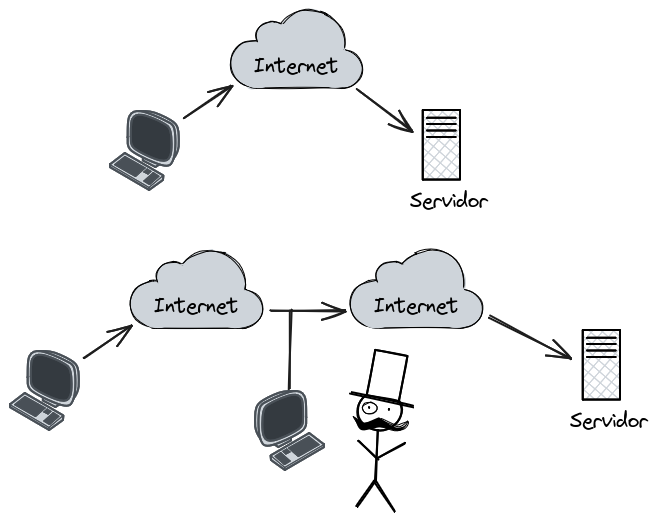
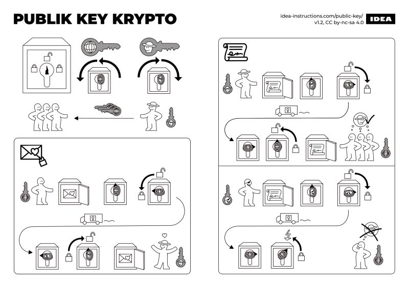
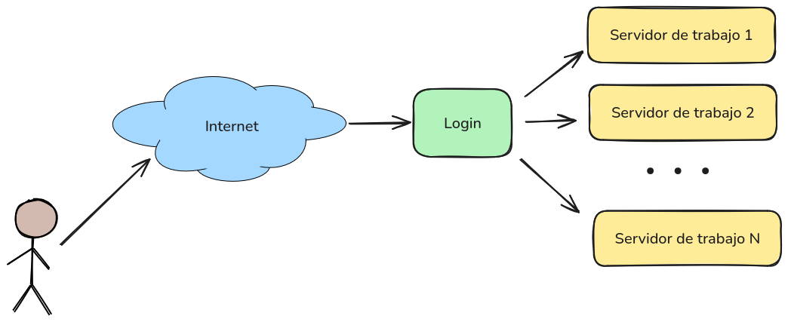

# SSH  Secure Shell

> Protocolo **criptográfico** de red para operar de forma segura en **redes inseguras**

- Surge para resolver el problema de las redes inseguras.



## Se usa para
- Login remoto


- Encriptar otros tipos de comunicación


## ¿Cómo se logra?
- Encriptación
- Fingerprint
- llaves publicas y privadas



## ¿Cómo lo uso?
    - openssh
    - putty

## Para usar openssh

```
ssh USUARIO@DIRECCION
```

## Contenedores para este curso



