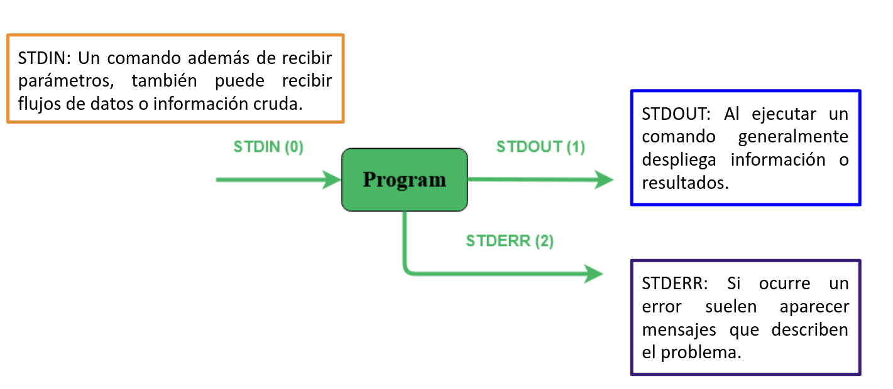

# **Comandos linux**

## **¿Qué es un comando?**

En el contexto de sistemas operativos basados en **Linux**, un comando
es una instrucción que se proporciona al sistema operativo para realizar
una tarea específica. Los comandos en **Linux** se ingresan a través de
una terminal o consola.

## Intérprete de comandos {#_intérprete_de_comandos}

En **Linux**, un intérprete de comandos, también conocido como shell, es
un programa que proporciona una interfaz de usuario para interactuar con
el sistema operativo. El shell acepta comandos ingresados por el
usuario, los interpreta y luego los ejecuta.

### Características del Intérprete de comandos: {#_características_del_intérprete_de_comandos}

**Prompt en Linux**

La línea de comandos muestra un indicador (prompt) que generalmente
muestra información sobre el usuario, la máquina y el directorio actual.
Este indicador está esperando a que el usuario ingrese un comando.

Ejemplo:

```
   maverick@rocky: $
```

Donde:

-   ***maverick*** es el nombre de usuario.
-   ***rocky*** es el nombre del host (equipo).

Podremos encontrar los siguientes símbolos `$` y `#`, los cuales tienen
diferentes significados:

**Prompt de usuario:**
-   Cuando se ve este símbolo `$`, nos indica que estás trabajando con 
    privilegios de usuarios normales.

-   Los comandos que ejecutas con este prompt tiene acceso solo a los
    recursos y archivos a los que el usuario tiene permisos.

**Prompt de superusuario o root:**
-   Cuando ve ve este símbolo `#`, indica que estás trabajando con
    privilegios de superusuario o root.

-   Los comandos ejecutados con este prompt tiene acceso total al sistema
    y pueden realizar cambios críticos, como instalar o desinstalar
    programas, modificar configuraciones del sistema, etc.

``` admonish warning title="Advertencia"
Es muy importante tener precaución al utilizar el prompt de superusuario
(`#`), ya que los comandos ejecutados con estos privilegios pueden
afectar al sistema de manera significativa. Por lo que te recomiendo
minimizar el uso de estos privilegios y solo utilizarlos cuando sea
necesario para evitar posibles problemas de seguridad o errores graves.
```

## ¿Para qué sirven los comandos? {#_para_qué_sirven_los_comandos}

Permite al usuario interactuar con el sistema operativo y realizar
diversas operaciones, como la navegación por el sistema de archivos, la
manipulación de archivos y directorios, la gestión de procesos entre
otras funciones.

Ejemplos: *ls*, *cd*, *pwd*, *cp*, *mv*, *rm*, *mkdir*, *cat*, *touch*,...

## Sintaxis básica de un comando {#_sintaxis_básica_de_un_comando}
```
    $ comando [opciones] [argumentos]
```

| <!-- -->   | <!-- --> |
|:----------:|----------|
| comando    | El nombre del comando que se va a ejecutar. |
| opciones   | Modificadores que afectan el comportamiento del comando.|
| argumentos | Datos que el comando necesita para realizar su tarea. |


## ¿Cómo saber las opciones del comando? *`(man)`* {#_cómo_saber_las_opciones_del_comando_emphasis_man_emphasis}

**Linux** cuenta con un gran número de comandos, por lo que saber todos
es complicado, por suerte existe **man** (manual) que nos dará
información del comando y las opciones con las que cuenta.
```
    $ man 'comando'
    $ man ping --> información del comando ping
```
- Para navegar a través de estas páginas usamos las flechas del teclado.
- Para buscar dentro del manual basta con escribir una barra `/`
  seguida del texto que queremos buscar y preionar `Enter`.
- Para pasar a la siguiente coincidencia presionamos la tecla `n` y
  para regresar a la coincidencia anterior presionamos `shift + n`.
- Para salir presionamos `q`.

`man` también es un comando, veamos el manual de `man`.
```
$ man man

MAN(1)                                                      Utilidades de paginador del manual                                                     MAN(1)

NOMBRE
        man - interfaz de los manuales de referencia del sistema

SINOPSIS
        man [opciones de man] [[sección] página ...] ...
        man -k [opciones de apropos] regexp ...
        man -K [opciones de man] [sección] term ...
        man -f [whatis opciones] página ...
        man -l [opciones de man] archivo ...
        man -w|-W [opciones de man] página ...

DESCRIPCIÓN
        man  es el paginador de manuales del sistema.  Cada argumento de página dado a man normalmente es el nombre de un programa, utilidad o función. La
        página de manual asociada con cada uno de estos argumentos es, pues, encontrada y mostrada.  Si se proporciona una sección, man mirará solo en esa
        sección  del  manual.   La  acción  predeterminada es buscar en todas las secciones disponibles siguiendo un orden predefinido (véase DEFAULTS), y
        mostrar solo la primera página encontrada, incluso si la página existe en varias secciones.
...
```

>Antes de continuar, descargemos el material necesario.
>
>Desde el home de usuario ejecuta:
>```
>    $ sudo cp -r /tmp/material-curso/taller .
>```
>El `.` hace referencia al directorio actual.

### ¿Dónde estamos? *`(pwd)`* 

El comando **pwd** (Print Work Directory) muestra la ruta absoluta del
lugar en que nos encontramos.
```
    $ pwd

    /home/user
```

### ¿Cómo ver el contenido de los directorios? *`(ls)`* 

El comando **ls** (LiSt) lista el contenido que hay en la ruta
especificada (si no recibe una ruta, muestra lo que hay en el directorio
en que nos encontramos).

**Ejemplo**
```
    $ ls

    Documentos    Imagenes    Descargas 
```

| **Comando** | **Descripción**|
|:-----------:|----------------|
| ls | Despliega el contenido del directorio donde se encuentre. |
| ls /etc/apt | Despliegue el contenido de la ruta que se especifique. (En este caso en directorio apt/) |
| ls -l | Utiliza formato de lista larga (muestra más detalles). |
| ls -a | No ignora entradas que empiecen con "." (archivos ocultos).|
| ls -t | Ordenar por tiempo de modificación (el más reciente primero). |
| ls -S | Ordena por tamaño de archivo.|

### ¿Cómo moverse entre los directorios? *`(cd)`* 

El comando **cd** (Change Directory) se utiliza para cambiar el
directorio actual en el que se encuentra.

**Ejemplo:**
```
   $ cd directorio

   $ cd ruta/del/directorio
```

| **Comando** | **Descripción**|
|:-----------:|----------------|
| cd | En el caso que **cd** se ejecute sin parámetros, cambiará al directorio personal del usuario (home). |
| cd ~ | También regresa al home del usuario, `'~'` hace referencia al directorio personal. |
| cd dir1/dir2 | Ir a la ruta especificada. (En este caso al directorio *dir2*). |
| cd .. | Cambia al directorio **padre** (un directorio arriba ó anterior de donde estamos). |
| cd ../../ | Cambia al directorio **padre**, del directorio **padre** (dos directorios arriba ó antes de donde nos encontremos). |
| cd / | Cambia al directorio raíz. |
| cd - | Cambia al directorio donde estábamos anteriormente. |

### ¿Como crear un directorio? *`(mkdir)`* 

**mkdir** (MaKe DIRectory) se utiliza para crear directorios.
```
   $ mkdir [opcion] nombreDirectorio
```
| **Comando** | **Descripción**|
|:-----------:|----------------|
| $ mkdir nombreCarpeta | Crea un directorio llamado *nombreCarpeta*. |
| $ mkdir -p carpeta1/carpeta2 | Crea directorios de manera recursiva. |

**Actividades**
>**1.** Ingresa al directorio `taller` y despliega su contenido en forma de lista.
>```
>   $ ls -l
>```
>**2.** Cambia la opción para mostrar los archivos ocultos.
>```
>    $ ls -a
>```
>**3.** Combiana las opciones para listar los archivos ocultos.
>```
>    $ ls -la
>```
>**4.** Crea los siguientes directorios `proyecto/linux/basico`.
>```
>   $ mkdir -p proyecto/linux/basico
>```
>**5.** Ingresa a `proyecto`.
>```
>   $ cd proyecto
>```
>**6.** Desde `proyecto`, muevete al directorio `linux/basico`.
>```
>   cd linux/basico
>```
>**7.** Desde `basico`, regresa al directorio `proyecto`.
>```
>   1. $ cd ../..
>   2. $ cd ~/taller/proyecto
>```
>**8.** Dentro de `taller`, crea los siguientes directorios: `dir1`, `dir2`, `dir3` y `dir4`.
>```
>   1. $ mkdir dir1 dir2 dir3 dir4     
>   2. $ mkdir ~/taller/dir1 ~/taller/dir2 ~/taller/dir3 ~/taller/dir4         (si te encuentras en otro directorio)
>```
>**9.** Verifica que los tres directorios fueron creados con `ls`.
>```
>   1. $ ls         (si te encuentras en taller)
>   2. $ ls ~/taller
>```

### ¿Y los archivos? *`(touch)`* 

**touch** (change file timestamps) Lo utilizaremos para crear archivos
vacíos.
```
   $ touch [opcion] 'nombreArchivo'
```
| **Comando** | **Descripción**|
|:-----------:|----------------|
| $ touch Documento | Crea un archivo llamado *Documento*.|
| $ touch ejemplo.txt | Crea un archivo llamado *ejemplo.txt*. |

### Crear una copia *`(cp)`* 

El comando **cp** (CoPy) lo utilizamos para copiar archivos y
directorios.
```
   $ cp [opcion] 'archivo/directorio' 'destino'
```

| **Comando** | **Descripción**|
|:-----------:|----------------|
| $ cp cancion musica/ | Copia el archivo *cancion* en el directorio *musica*. |
| $ cp -r temp/ aux/   | Copia el contenido del directorio *temp* en el directorio *aux* de manera recursiva. |

### ¿Cómo se puede mover un directorio o archivo? *`(mv)`* 

Para mover de lugar un archivo o directorio utilizamos el comando **mv**
(MoVe).
```
    $ mv [opcion] 'archivo/directorio' 'destino'
```

| **Comando** | **Descripción**|
|:-----------:|----------------|
| $ mv archivo ruta/del/destino | Mueve *archivo* a *ruta/del/destino*. |
| $ mv carpeta1 carpeta2 | Mueve la *carpeta1* a *carpeta2*  |
| $ mv file1 file2 file3 dir/ | Mueve *file1 file2 file3* al directorio *dir* |

### Renombrar un directorio o archivo *`(mv)`* 

Con **mv** también podemos renombrar un archivo o directorio.
```
   $ mv [opcion] 'nombre' 'nuevoNombre'
```

| **Comando** | **Descripción**|
|:-----------:|----------------|
| $ mv nombre nuevoNombre | Cambia el nombre de el archivo/directorio *nombre* a *nuevoNombre*.|

**Actividades**

>**10.** Ingresa al directorio `dir1` y crea los archivos `file.txt` y `documento` (verifica que se creen los archivos).
>```
>   1. cd ~/taller/dir1
>   2. touch file.txt documento
>```
>**11.** Crea una copia de `file.txt`, nómbrala `file2.txt`.
>```
>   $ cp file.txt file2.txt
>```
>**12.** Copia el archivo `documento` en `proyecto`.
>```
>   $ cp documento ~/taller/proyecto
>```
>**13.** Copia el directorio `proyecto` en `dir2`.
>```
>   $ cp -r ~/taller/proyecto ~/taller/dir2
>```
>**14.** Desde el directorio `dir1`, mueve el archivo `file.txt` al directorio `dir3`.
>```
>   1. $ mv file.txt ../dir3   
>   2. $ mv file.txt ~/taller/dir3
>```
>**15.** Renombra el archivo `documento` a `ejercicio`. 
>```
>   $ mv documento ejercicio
>```

### Eliminar un directorio vacío *`(rmdir)`* 

**rmdir** (ReMove DIRectory) lo utilizaremos para eliminar directorios
**vacíos**, es decir, aquellos que no contengan subdirectorio ni archivos.
```
   $ rmdir [opcion] 'directorioVacio'
```
### Eliminar archivos *`(rm)`* 

Con **rm** (ReMove) podemos eliminar archivos, además de directorio que
**no** estén vacíos.
```
   $ rm [opcion] 'archivo'
```

| **Comando** | **Descripción**|
|:-----------:|----------------|
| $ rm documento.txt | Elimina el archivo *documento.txt*. |
| $ rm -r directorio/ | Elimina de manera recursiva *directorio* y todo su contenido. |
| $ rm -i aux.txt | Solicita confirmación antes de eliminar el archivo *aux.txt*. |

```admonish info title="Nota"
La opción `-r` (recursivo) es esencial cuando se utiliza `rm` para
eliminar directorios y su contenido. Sin está opción, `rm` no
eliminará directorios.
```


```admonish warning title="Importante"
Antes de eliminar cualquier archivo o directorio, hay que estar
completamente seguros de que ya no son necesarios, pues tanto `rmdir`
con `rm` no solicitan algún tipo de confirmación y todo lo eliminado
no se podrá recuperar.
```

### ¿Qué está escrito aquí? *`(cat)`* 

El comando **cat** (conCATenate) se utiliza para mostrar y concatenar el
contenido de archivos.
```
    $ cat [opcion] file
```

| **Comando** | **Descripción**|
|:-----------:|----------------|
| $ cat *ejemplo.txt* | Muestra el contenido del archivo *ejemplo.txt*. |
| $ cat -n documento | Enumera todas las líneas de *documento* | 
| $ cat documento1 documento2 | Muestra en contenido de *documento1* y *documento2* |

### ¿Hay otra forma de ver el contenido de mi archivo? *`(less)`* 

Si, **less** (LESS is more) también nos permite visualizar el contenido
de los archivos.
```
    $ less [opcion] file
```

| **Comando** | **Descripción**|
|:-----------:|----------------|
| $ less hola.c | Muestra en contenido de hola.c |

```admonish note title="Nota"
Presionamos *q* para salir de less.
```

**Diferencias entre *`cat`* y *`less`***

| **cat** | **less** |
|:--------|:---------|
| Su función principal es concatenar y mostrar el contenido de archivos en la salida estándar (generalmente la pantalla). | Permite visualizar el contenido de archivos de manera paginada, lo que facilita la navegación por grandes cantidades de datos. A diferencia de *cat*, *less* muestra el contenido de manera que se puede desplazar hacia arriba y hacia abajo.
|`$ cat archivo1 archivo2` muestra el contenido de **archivo1** seguido por el contenido de **archivo2**.      | `less archivo.txt` permite ver el contenido de *archivo.txt* de manera paginada, facilitando la lectura y la navegación. |
|Muestra todo el contenido de los archivos de una vez. Puede ser útil para archivos pequeños o cuando simplemente se quiere ver rápidamente el contenido completo.|  Permite desplazarse hacia arriba y hacia abajo, realizar búsquedas y ofrece otras funciones de visualización más avanzadas. |

### ¿Dónde lo encuentro? *`(find)`* 

Para buscar directorios o archivos utilizaremos el comando **find**
(encontrar).
```
    $ find [ruta] [opciones] -name 'coincidencia'
```

| **Comando** | **Descripción**|
|:-----------:|----------------|
| $ find /home/usuario -name '*.txt' | Busca los archivos con extensión '.txt' en el directorio especificado.|

El asterisco (`*`) en el comando `find` se utiliza como un comodín que permite 
buscar archivos que coincidan parcialmente con el patrón especificado.

**Ejemplo**

Encontrar los archivos que comiencen con `doc` en un directorio.
```
    $ find ruta/directorio -name 'doc*'
```

**Actividades**
>**16** Desde `taller`, elimina el directorio `dir4` (directorio vacio).
>```
>   $ rmdir dir4
>```
>**17** Elimina el directorio `basico`, se encuentra en `proyecto/linux` (directorio vacio).
>```
>   $ rmdir proyecto/linux/basico
>```
>**18** Elimina el archivo `file2.txt` del directorio `dir1`.
>```
>   $ rm dir1/file.txt
>```
>**19** Elimina el directorio `proyecto`
>```
>   $ rm -r proyecto
>
>Recuerda que al tratarse de un directorio no vacío, se elimina de manera recursiva (-r).
>```
>**20** Ingresa al directorio `taller/dia-1` y muestra el contenido de `Dewey`.
>```
>   1. $ cat Dewey
>   2. $ less Dewey
>```
>**21** Muestra el contenido de `Dewey` y `frases` en una sola instrucción. 
>```
>   $ cat Dewey.txt frases.txt
>```
>**22** Encuentra los archivos que comiencen con `eje` y terminen con `.txt` en el directorio `taller`.
>```
>   $ find ~/taller -name 'eje*.txt'
>```

### Limpiemos la pantalla 

Una manera de limpiar la pantalla es utilizando `ctrl + l`, seborra el 
contenido visible en la terminal, pero el historial de comandos y 
resultados anteriores sigue estando disponible. 

Otra manera en utilizando el comando `clear` (limpiar). Al utilizar este comando, 
borrará por completo el contenido de la terminal.
```
    $ clear
```

**Historial de comandos**

La mayoría de los shells mantienen un historial de comandos previos, lo
que facilita la recuperación y repetición de comandos anteriores.

## Entrada, Salida y Error Estándar  {#_entrada_salida_y_error_estándar}


***Figura 1. Entrada, Salida y Error Estándar***
