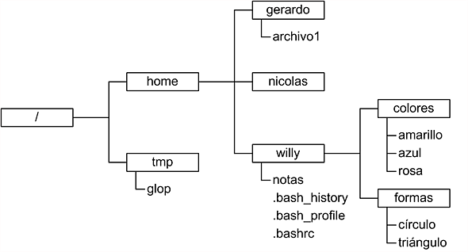
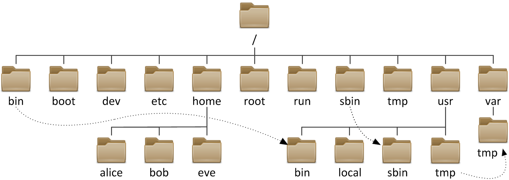

# Sistema de Archivos UNIX
> El sistema de archivos es el corazón de un sistema tipo unix.

## ¿Qué es un sistema de archivos?
> - Una estructura de datos que organiza la información en un dispositivo de almacenamiento, como un disco duro.
> - Transforma bloques de datos en una jerarquía de directorios y archivos, facilitando su acceso y gestión.


El propósito básico de un sistema de archivos es:
> - Organizar los recursos de almacenamiento.
> - Organizar los **archivos**.


## Todo es un archivo

¿Pero qué es un archivo?
> Una serie de bits con nombre y tamaño y cosas parecidas.

```admonish info title="Participación"
**¿Cúales de las siguientes cosas esperarías encontrar en un sistema de archivos?**
- Procesos.
- Directorios.
- Dispositivos de audio.
- Canales de comunicación entre procesos.
- Estructuras de datos del kernel.
- Fotografías.
- Textos.
- Configuracion de aplicaciones.
- Secciones de la memoria RAM.
```

```admonish info title="Pista"
"En un sistema tipo UNIX, todo es un archivo."
```

> Idea que utilizan los sistemas tipo UNIX para gestionar Entrada/Salida de recursos
> como flujos de bytes expuestos  através del sistemas de archivos.

Algunas ventajas de este enfoque
1. Archivos y dispositivos de Entrada/Salida (teclado,pantalla,etc.) son tan similares como es posible.
    - Los nombres de archivo y dispositivo tienen la misma sintaxis y significado, por lo que un programa que espera un nombre de archivo como parámetro puede pasar un nombre de dispositivo.
3. Los archivos especiales están sujetos al mismo mecanismo de protección que los archivos normales.


## Componentes de un sistema de archivos
- Namespace 
- API 
- Seguridad 
- Implementación 

**Namespace** (¿Cómo nombro a los archivos?)
- Una forma de nombrar las cosas y organizarlas jerárquicamente.
- Árbol de archivos [Árbol de archivos](#Árbol-de-archivos)
y [pathname](#pathname)

**API** (comandos para manipulación de archivos)
- Un conjunto de llamadas al sistema para navegación y manipulación de objetos.
- **Comandos de navegación y manipulación de archivo.**
- `Universal I/O Model (stdio.h)`

**Modelo de seguridad** (Permisos)
- Un modelo para proteger, esconder y compartir cosas.
- **Esquema de permisos.**

**Implementación** (Incluida en el kernel)
- Software para unir el modelo al hardware.
- **Drivers o módulos del kernel.**

```admonish info title="Participación"
- ¿Qué sistemas de archivos conoces?
- ¿En qué contextos es importante un esquema de permisos?
- ¿Hay que instalar el sistema de archivos?
```

### Árbol de archivos

En Linux se mantiene una **única estructura de directorios
jerárquica** para organizar **todos los archivos del sistema.**

```admonish info title="Participación"
- ¿Qué diferencia tiene la estructura del sistema de archivos UNIX con la de otros sistemas operativos?
```

#### Archivos
Datos con un nombre asociado.

#### Directorios
Tipo de **archivo** especial cuyo contenido toma la forma de una tabla con
- nombres de archivos

### Reglas

- AL **nombre de archivo con referencia** se le llama **link**
- Cada archivo puede tener multiples links (muchos nombres)
- Un directorio puede listar links a archivos o a directorios.
- Los links a directorios establecen una jerarquia (Padres e hijos)

- Cada directorio tiene al menos dos entradas
    - . (punto): link al mismo directorio
    - .. (punto-punto): link a su directorio padre


```admonish info title="Participación"
- Si un archivo tiene muchos nombres (links) ¿Está duplicado?
- Si el directorio Simba está listado dentro del directorio Mufasa ¿Cuál es el directorio padre?
```

### Pathname

- Estructura jerárquica de varios niveles
- En la parte superior del sistema de archivos hay un directorio llamado
\"raíz\" que se representa con \"/\".
- Todos los demás archivos son \"descendientes\" de la raíz.



***Figura 2. Representación de un pathname.***

- la referencia a un archivo/directorio (Nombre completo) debe ser hecha a través de su **pathname**.

La lista de directorios que se deben recorrer para localizar un archivo en 
particular más el nombre de ese archivo forman un pathname o ruta.

Por ejemplo:

```
    /directorio1/directorio2/.../directorioN/archivo
```

#### Caracteres especiales para escribir rutas
|Símbolo   |Descripción   |
|---|---|
| /  |Hace referencia al directorio raíz y a la separación entre directorios   |
| .  |Hace referencia al directorio actual   |
| ..  | Hace referencia al directorio padre del directorio actual  |

#### Ruta absoluta {#_ruta_absoluta}

Especifica la ruta completa desde el directorio raíz hasta el archivo o
directorio. Comienza con una barra inclinada ('/').

```
    /home/willy/notas
```

```admonish info title="Participación"
- ¿Cuál es la ruta absoluta al archivo glob?
- ¿Cuál es la ruta absoluta al archivo triangulo?
- ¿Cuál es la ruta absoluta al archivo .bashrc?
```

#### Ruta relativa {#_ruta_relativa}

- Especifica la ruta desde el directorio de trabajo actual (Tema de comandos básicos)
- No comienza con una barra inclinada ('/').

Por ejemplo desde el directorio home
```
    willy/notas
```

```admonish info title="Participación"
- ¿Cuál es la ruta relativa del archivo glop, si estoy en el directorio "/"?
- ¿Cuál es la ruta relativa del archivo notas, si estoy en el directorio home?
- ¿Cuál es la ruta relativa del archivo archivo1, si estoy en el directorio colores?
- ¿Cuál es la ruta relativa del directorio home, si estoy en el directorio formas?
```

# Tipos de Archivos {#_tipos_de_archivos}

- **Archivos ordinarios**: Series de bits.
- **Directorios**: Contienen referencias a otros archivos (nombres de archivos)
- **Enlace simbólico**: Distintas rutas para un mismo archivo de forma relativa.
- **Enlace duro**: Distintas rutas para un mismo archivo de forma absoluta.
- **Dispositivos de bloque o caracter:** Se utilizan para representar un dispositivo físico real, como una impresora.
- **Pipes (Tuberías)**: para vincular comandos. La tubería actúa como un archivo temporal que solo existe para contener datos de un comando hasta que los lea otro.
- **Sockets**: permite una comunicación entre procesos, incluso procesos ejecutándose en otras computadoras.

# Árbol del sistema

***Figura 1. Representación de una árbol de archivos.***

| **Directorio** | **Descripción** |
|:--------------:|:----------------|
| /                     | directorio principal.
| /bin (binarios)       | Contiene **programas** para el funcionamiento del **sistema**.
| /boot (arranque)      | Contiene archivos para el proceso de arranque del sistema, como el **kernel** y los archivos de **configuración del gestor de arranque**.
| /dev (dispositivos)   | Contiene archivos especiales que representan **dispositivos** del sistema, como discos, particiones y periféricos.
| /etc (configuración)  | Almacena archivos de **configuración** del sistema y de las aplicaciones instaladas en el sistema.
| /home (hogar)         | Es el directorio principal de los **usuarios** regulares.
| /lib (bibliotecas)    | Contiene **bibliotecas** compartidas necesarias para la ejecución de programas del sistema y usuario.
| /mnt (montaje)        | Se utiliza para **montar** sistemas de archivos adicionales o dispositivos de almacenamiento temporalmente.
| /proc (proceso)       | Proporciona información en tiempo real sobre los **procesos** en ejecución y otros detalles del sistema.
| /root                 | El directorio **hogar del usuario "root"**, que es el superusuario o administrador del sistema.
| /bin (binarios del sistema) | Contiene archivos ejecutables generales.
| /tmp (temporal)       | Directorio utilizado para almacenar archivos temporales,se borra al apagar el equipo, todos los usuarios tienen acceso a este directorio.
| /usr (usuario)        | Contiene archivos y programas utilizados por usuarios.
| /var (variable)       | Almacena datos variables, como registros de sistemas y archivos de bases de datos, logs de eventos del sistema.


```admonish info title="Participación"
- Si acabo de instalar un servidor web en mi computadora y quiero modificar su configuración ¿A qué directorio debo ir?
- Si no estoy seguro de haber instalado una nueva versión del kernel en mi computadora ¿A qué directorio debo ir?
- Si quiero crear un archivo pero deseo que este archivo se borre automáticamente después ¿En qué directorio debo crearlo?
- Si quiero saber si alguién intentó ingresar a mi computadora durante mis vacaciones ¿En qué directorio debería buscar?
- Si quiero saber qué discos duros tengo en el equipo ¿En que directorio debería buscar?
```
