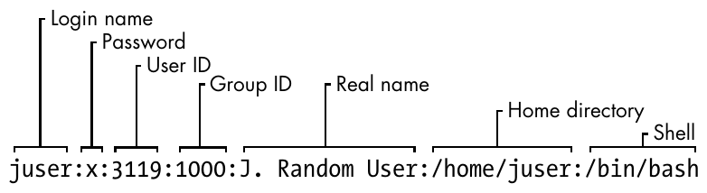
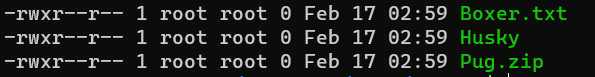
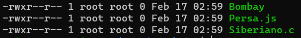

# Usuarios, grupos y permisos

# Usuarios

## ¿Qué es un usuario? {#_qué_es_un_usuario}

Un usuario se refiere a una cuenta individual que puede ser utilizada
por una persona o un programa para acceder al sistema operativo. Cada
usuario tiene un identificador único llamado "UID" (User ID) y
pertenece a uno o más grupos, identificados por "GID" (Group ID).

### Tipos de usuarios {#_tipos_de_usuarios}

*Superusuario o root:* El usuario \"root\" es el administrador del
sistema con privilegios totales. Tiene acceso completo a todos los
recursos del sistema y puede realizar cualquier acción, incluyendo la
instalación y desinstalación de software,configuración del sistema y
gestión de usuarios.

*Usuario común o estándar:* Este es el tipo de usuario regular que se
utiliza para tareas diarias.

## Grupos {#_grupos}

En Unix, un \"grupo\" es una colección de uno o más usuarios que
comparten ciertos privilegios y permisos en el sistema. Los grupos
proporcionan una forma eficiente de administrar permisos y controlar el
acceso a recursos del sistema.

## Archivos especiales de usuarios {#_archivos_especiales_de_usuarios}

### /etc/passwd

El archivo /etc/passwd es un archivo de texto plano que almacena
información sobre las cuentas de usuario en el sistema.

**Una lista de usuarios en */etc/passwd***
```
    root:x:0:0:Superuser:/root:/bin/sh
    daemon:*:1:1:daemon:/usr/sbin:/bin/sh
    bin:*:2:2:bin:/bin:/bin/sh
    sys:*:3:3:sys:/dev:/bin/sh
    nobody:*:65534:65534:nobody:/home:/bin/false
    juser:x:3119:1000:J. Random User:/home/juser:/bin/bash
    beazley:x:143:1000:David Beazley:/home/beazley:/bin/bash
```

Cada línea representa un usuario y tiene siete campos separados por dos
puntos.



***Figura 1. Una entrada del archivo _/etc/passwd_***

1.  *Login name*: Nombre del usuario.

2.  *password*: En versiones modernas, este campo suele contener una
    \"x\" o un \"\*\" para indicar que la contraseña está almacenada en
    el archivo /etc/shadow para mayor seguridad.

3.  *User Id* (UID): Un número único que identifica de manera única al
    usuario en el sistema. Es el equivalente al ID de usuario.

4.  *Group Id* (GID): Indica el ID del grupo principal al que pertenece
    el usuario.

5.  *Real name*: Nombre real de usuario

6.  *Home directory*: La ruta al directorio principal del usuario, donde
    se encuentra su espacio de trabajo por defecto.

7.  *Shell*: La ruta al programa de shell que se utilizará cuando el
    usuario inicie sesión. Este programa define la interfaz de línea de
    comandos para el usuario.

### /etc/group/

El archivo */etc/group* contiene información sobre los grupos del sistema.
Cada línea en este archivo representa un grupo y contiene varios campos
separados por dos puntos ':'.

**Una lista de grupos en */etc/group***
```

    root:*:0:juser
    daemon:*:1:
    bin:*:2:
    sys:*:3:
    adm:*:4:
    disk:*:6:juser,beazley
    nogroup:*:65534:
    user:*:1000:
```

Cada línea representa un grupo y tiene cuatro campos separados por dos
puntos:


***Figura 2. Una entrada del archivo _/etc/groups_***

1.  *Group name*: Identifica el nombre del grupo.

2.  *Password*: Similar al archivo /etc/passwd, este campo generalmente
    contiene una \"x\" o \"\*\" para indicar que la contraseña se
    almacena en el archivo /etc/gshadow.

3.  *Group ID*: Un número único que identifica de manera única al grupo
    en el sistema.

4.  *Additional members*: Enumera los nombres de usuario que son
    miembros del grupo, separados por comas.

```admonish note title="Nota"
para saber a qué grupos pertenece un usuario se usa el comando *groups*

    $ groups
```

### /etc/shadow

El archivo /etc/shadow, Al igual que /etc/passwd y /etc/group, es un
documento de texto plano que contiene información crítica en sistemas
Unix y Linux. /etc/shadow fue diseñado para almacenar de manera segura
las contraseñas de los usuarios.


**Una entrada del archivo _/etc/shadow_**
```
    root:$6$xP.qrgsIXaIaS4h6$ZeA/pqmicjEBSRduFToBCX.fYUNqAwOQ/zP.KUUkIWBLQog6znFb.81X/V3ztyfTC3uxR4Ws5TCEHJS7Hvgbi/::0:99999:7:::
    bin:*:18505:0:99999:7:::
    daemon:*:18505:0:99999:7:::
    adm:*:18505:0:99999:7:::
    lp:*:18505:0:99999:7:::
    nobody:*:18505:0:99999:7:::
```

Cada línea representa un usuario y tiene nueve campos separados por dos
puntos:

1.  Nombre de usuario (username): Identifica el nombre del usuario.

2.  Contraseña (password): Almacena una versión cifrada o hash de la
    contraseña del usuario.

3.  Fecha de la última modificación (last password change): Representa
    la fecha de la última modificación de la contraseña, medida en días
    desde el 1 de enero de 1970 (época de Unix).

4.  Período de inactividad (min days): Número mínimo de días antes de
    que el usuario pueda cambiar su contraseña.

5.  Período de validez de la contraseña (max days): Número máximo de
    días antes de que el usuario deba cambiar su contraseña.

6.  Avisos de cambio de contraseña (warm days): Número de días antes de
    que el sistema advierte al usuario sobre la necesidad de cambiar su
    contraseña.

7.  Periodo de cuenta inactiva (inactive): Número de días de inactividad
    después de los cuales la cuenta se desactivará.

8.  Fecha de caducidad de la cuenta (expire date): Fecha en la que la
    cuenta se bloqueará, expresada en días desde la época de Unix.

9.  Reservado (reserved): Campo reservado para uso futuro.

## Comando Sudo {#_comando_sudo}

El comando **sudo** se utiliza para ejecutar un comando con privilegios
de superusuario (root). Estos comandos pueden ser para agregar o
eliminar usuarios, eliminar archivos que pertenecen a otros usuarios e
instalar nuevo software.
```
    $ sudo [opciones] 'comando'
```

Cuando se ejecuta el comando **sudo**, generalmente se pedirá que
ingreses tu contraseña para verificar que tienes los permisos adecuados.

Es importante usar **sudo** con precaución, ya que los comandos con
privilegios elevados pueden afectar el sistema y los archivos críticos.
Solo debes de ejecutar comandos con **sudo** si estás seguro de lo que
estás haciendo y comprender las implicaciones de tus acciones.

Un consejo es revisar las propiedades de los archivos.\

¿Con qué comando desplegamos el contenido de un directorio en forma de
lista?
```admonish success title="Repuesta"
    1.  $ ls -l

    2.  $ ls -la
```

## Creación de usuarios {#_creación_de_usuarios}

Usaremos el comando **useradd** para crear un nuevo usuario
```
    # useradd [opcion] 'nombreUsuario'
```
| **Opciones** | **Descripción** |
|:------------:|-----------------|
| -d , --home-dir | Establece el directorio de inicio del usuario. |
| -s , --shell | Establece el shell del usuario. |
| -u , --uid | Asigna el ID de usuario (UID). |
| -U | Crea un grupo con el mismo nombre que el usuario y agregue el usuario a este grupo. (user-group). |
| -m , --create-home | Crea el directorio personal (home) del usuario si no existe. |
| -p , --password | Asigna una contraseña al usuario nuevo. |

```admonish note title="Nota"
Se necesitan permisos de super usuario.
```

Para crear el usuario charmander, se ejecuta el comando:
```
    # useradd charmander
```
Para crear el usuario pikachu con el ID 1005 y crear su home
```
    # useradd pikachu -m -u 1005
```

## ¿Y la contraseña? {#_y_la_contraseña}

Aunque **useradd** da la opción **-p** para asigna contraseña al usuario
que se está creando, esto no es muy usado, ya que podría quedar expuesta
en registros del sistema o en la salida de comandos, lo que representa
riesgos de confidencialidad.

Para asignar contraseña a un usuario utilizamos el comando **passwd**
```
    # passwd [opción] usuario
```

| **Opción** | **Descripción** |
|:----------:|-----------------|
| -d , --delete | Elimina la contraseña del usuario. |
| -l , --lock | Permite bloquear la contraseña del usuario.|
| -x , --maxdays | Determina después de cuántos días debe renovarse una contraseña. |
| -w , --warndays | Avisa al usuario que la contraseña esta apunto de caducar. |

```admonish note title="Nota"
Se necesitan permisos de super usuario.
```

La contraseña debe contener de 6 a 8 caracteres, incluyendo uno o más
caracteres de los siguientes conjuntos.

-   Alfabeto en minúsculas.

-   Dígitos del 0 al 9.

-   Signos de puntuación.

```admonish warning title="Importante"
`passwd` rechazará cualquier contraseña que no sea lo suficientemente
compleja.
```

Ejemplo:
```
    # sudo passwd vulpix
    Introduce una nueva contraseña UNIX:
    Vuelve a introducir la nueva contraseña UNIX:
    passwd: Se ha cambiado la contraseña con éxito.
```
## Eliminar Usuarios {#_eliminar_usuarios}

Para eliminar un usuario utilizaremos el comando **userdel**
```
    $ sudo userdel [opciones] usuario
```
```admonish note title="Nota"
Se requieren permisos de superusuario
```

| **Opción** | **Descripción** |
|:----------:|-----------------|
| -r , --remove | Borra el directorio de inicio del usuario /home/usuario .|

## Creación de grupos {#_creación_de_grupos}

Para crear un nuevo grupo usaremos el comando **groupadd**
```
    $ sudo groupadd [OPCIONES] ‘nombreGrupo’
```

| **Opción** | **Descripción** |
|:----------:|-----------------|
| -g , --gid | Asigna un identificador (GID) al grupo. |
| -p\ , --passwdord | Asigna una contraseña al grupo.   |

```admonish note title="Nota"
Se requieren permisos de superusuario.
```

Ejemplo:
```
    $ sudo groupadd planta -g 203
    $ sudo groupadd dragon -g 2001 -p 1234
```

## Modificar Grupos  {#_modificar_grupos_asciidoc_br}

### Agregar usuarios a un grupo {#_agregar_usuarios_a_un_grupo}

Para agregar usuarios a un grupo utilizamos la siguiente instrucción:
```
    $ sudo usermod -aG ‘grupo‘ ‘usuario’
```

### Eliminar usuarios de un grupo {#_eliminar_usuarios_de_un_grupo}

Para eliminar un miembro de un grupo suplementario, utilizaremos el
comando **usermod** listando los grupos suplementarios de los que el
usuario siga siendo miembro.

Ejemplo: Si el usuario 'charizard' es miembro de los grupos volador,
dragon, fuego y agua, para eliminar al usuario del grupo agua,
utilizaremos la siguiente instrucción:
```
    $ sudo usermod -G volador,dragon,fuego charizard
```

¿Con qué comando se sabe a cuántos grupos permanece un usuario.?
```admonish success title="Respuesta"
    $ groups
```

## Eliminar grupos *(groupdel)* {#_eliminar_grupos_emphasis_groupdel_emphasis}

Para eliminar un grupo usamos el comando **groupdel**
```
    $ groupdel [opciones] ‘nombreGrupo’
```

eliminaremos el grupo fuego
```
    $ sudo groupdel fuego
```

# Permisos

Cada directorio y archivo cuentan con permisos, estos cumplen con la
función de designar qué usuarios tendrán acceso a modificar o trabajar
con cada uno de estos.

***Permisos del Usuario:*** Son los permisos que se aplican al propietario
de un determinado archivo o directorio.

***Permisos del Grupo:*** Estos permisos definen los derechos de lectura,
escritura y ejecución que se aplican sólo a aquellos usuarios que
pertenecen al mismo grupo propietario del archivo/directorio.

***Permisos de Otros:*** Estos permisos indican los derechos de lectura,
escritura y ejecución del resto de los usuarios.

¿Cómo saber los permisos de los archivos y directorios?
```admonish success title="Respuesta"
    1.  \$ ls -l
    2.  \$ ls -la
```

Para conocer los permisos de archivo en específico ejecutamos:
```
    $ ls -l 'nombreArchivo'

    -rwxr-xr-x  1  user  user  0  jun 25 15:43  'nombreArchivo'
```

El primer bit indica el tipo de archivo. Generalmente se puede tratar de
los siguientes casos:

| <!----> | <!---->|
|:-------:|--------|
| **-** | Se trata de un archivo regular. |
| **d** | Se trata de un directorio.        |
| **l** | Se trata de un enlace simbólico.  |


El resto de los 9 bits a continuación representan los permisos del
propietario del archivo o directorio, los del grupo al que pertenece
este usuario y los del resto de usuario.

| <!----> | <!---->|
|:-------:|--------|
| **r** |Permisos de lectura.    |
| **w** | Permisos de escritura. |
| **x** | Permisos de ejecución. |
| **-** | No tiene permiso de lectura, escritura o ejecución. |


***Figura 1. Representación de los permisos de un archivo****

## Representación numérica {#_representación_numérica}

En este caso se sustituye en grupos de 3 bits (*r*, *w* y *x*) por un *1*
ó *0*, dependiendo de si se da o no el permiso, al final, del número en
binario obtenido, lo representamos en número decimal para representar
las diferentes combinaciones (r w x).

| **Permisoso** | **Binario**| **Decimal** |
|:-------------:|:----------:|:-----------:|
| r - -         | 1 0 0      | 4           |
| - w -         | 0 1 0      | 2           |
| - - x         | 0 0 1      | 1           |

Tomando en cuenta la tabla anterior, podemos obtener el número que es la
suma de todos los anteriores, dependiendo si se dan o no los permisos.

| **Permisos** | **Binario** | **Decimal** | **Descripción** |
|:------------:|:-----------:|:-----------:|-----------------|
| r w x | 1 1 1 | 7 | Permisos de lectura, escritura y ejecución. |
| r w - | 1 1 0 | 6 | Permisos de lectura y escritura. |
| r - x | 1 0 1 | 5 | Permisos de lectura y ejecución. |
| r - - | 1 0 0 | 4 | Permiso de lectura. |
| - w x | 0 1 1 | 3 | Permisos de escritura y ejecución. |
| - w - | 0 1 0 | 2 | Permiso de escritura. |
| - - x | 0 0 1 | 1 | Permiso de ejecución. |
| - - - | 0 0 0 | 0 | Sin permisos.   |

**Vamos por lo que necesitamos**

¿Como nos colocamos en /home/seiya?
```admonish success tilte="Respuesta"
    $ cd
```

Primero creamos un directorio.
```
    $ mkdir 'directorio'
```

Descargemos el material.
```
    $ sudo cp -r /tmp/material-curso/user 'directorio'
```

Dentro del directorio *user* encontraras dos directorio:
```
    Perros Gatos
```

Ingresemos en el directorios Perros.
```
        $ cd Perros
```

¿Como se muestran los permisos del contenido del directorio?.
```admonish success tilte="Respuesta"
    # ls -l
    # ls -la
    
Recuerda que la opcion '-la' no ingnora los archivos ocultos.
```



***Figura 2. Permisos del directorio Perros***

Aquí tenemos un error, los archivos de este directorio no necesitan
permisos de ejecución, vamos a solucionarlo.

## Modificar los permisos de un archivo/directorio *(chmod)* {#_modificar_los_permisos_de_un_archivo_directorio_emphasis_chmod_emphasis}

El comando **chmod** se utiliza para cambiar los permisos de archivos y
directorios.
```
    $ sudo chmod [opciones] permisos 'archivo/directorio'
```

| <!----> | <!----> |
|:-------:|---------|
| opciones | Pueden ser varias opciones, como `-R` para cambiar permisos de forma recursiva en directorios y subdirectorios, para saber mas revisa el *man*. |
| permisos | Representa los permisos que deseas asignar al archivo o directorio. |
| archivo/directorio | Es el nombre del archivo o directorio que se le cambiarán los permisos. |

Recuerda que si no eres el propietario del archivo/directorio, deberás
tener privilegios de superusuario (root).

### Actividades {#_actividades}

Modifica los permisos del archivo Boxer.txt a los siguientes:

***Permisos de Boxer.txt***
```
    -rw-r--r-- 1 root root 0 Feb 09:34 Boxer.txt
```

```admonish success title="Respuesta"
    $ sudo chmod 644 Boxer.txt
```

Modifica los permisos de Husky a los siguientes:

***Permisos de Husky***
```
    -rw-rw-r-- 1 root root 0 Feb 09:34 Husky
```
```admonish success title="Respuesta"
    $ sudo chmod 664 Husky
```

Modifica los permisos de Pug.zip a los siguientes:

***Permisos de Pug.zip***
```
    -rw-r----- 1 root root 0 Feb 09:34 Pug.zip
```
```
    $ sudo chmod 640 Pug.zip
```
    
**Revisa los permisos del directorio Gatos.**



***Figura 3. Permisos del directorio Gatos***


Tenemos el mismo error que en el directorio Perros, vamos a modificar
los permisos.

**Cambia los permisos de todos los archivos del directorio Gatos de
manera recursiva a los siguientes:**

***Nuevos permisos de Gatos***
```
    -rw-r--r-- 1 root root 0 Feb 09:36 Bombay
    -rw-r--r-- 1 root root 0 Feb 09:36 Persa.js
    -rw-r--r-- 1 root root 0 Feb 09:36 Siberiano.c
```
```admonish success title="Respuesta"
    $ sudo chmod -R 644 Gatos
```

## Cambio de Propietarios *(chown)* {#_cambio_de_propietarios_emphasis_chown_emphasis}

El comando **chown** se utiliza para cambiar el propietario y/o grupo de
archivos y directorios.
```
    $ sudo chown [opciones] nuevoPropietario[:nuevoGrupo] 'archivo/directorio'
```
| <!----> | <!----> |
|:-------:|---------|
| nuevoPropietario | Especifica el nuevo propietario al que se desea asignar el archivo o directorio. |
| nuevoGrupo | Permite especificar un nuevo grupo para el archivo o directorio. Si no se proporciona, el grupo se mantendrá sin cambios. |
| archivo/directorio | Es el nombre del archivo o directorio que se le cambiarán los permisos. |

Recuerda que si no eres el propietario del archivo/directorio, deberás
tener privilegios de superusuario (root).

### Actividades {#_actividades_2}

**Cambia el propietario del archivo que elijas por un usuario que
creaste anteriormente.**
```admonish success title="pista"
    $ sudo chwon 'nombrePropietario' 'nombreArchivo'
```

**Cambiar el propietario y el grupo de un archivo al mismo tiempo:**
```admonish success title="pista"
    $ sudo chown 'nuevoPropuetario:nuevoGrupo' 'nombreArchivo'
```

**Cambia el propietario y grupo del directorio Perros y todos sus
archivos y subdirectorios de forma recursiva por un ausuario antes
creado.**
```admonish success title="pista"
    $ sudo chown -R 'nuevoPropietario:nuevoGrupo' Perros
```

    
