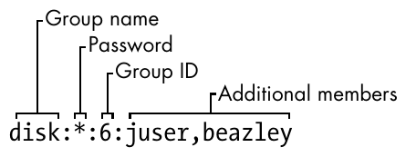

# Usuarios

## ¿Qué es un usuario? {#_qué_es_un_usuario}

Un usuario se refiere a una cuenta individual que puede utilizar los 
recursos del sistema, como archivos, directorios y aplicaciones. 
Cada usuario tiene su propio espacio de trabajo (generalmente su 
directorio personal o home) y un conjunto de permisos que determinan 
lo que puede o no hacer dentro del sistema.

**Información básica del usuario**

A cada usuario se le asignan los siguientes atributos:

- ***Nombre de usuario:*** Nombre único para identificar al usuario.

- ***UID (User ID):*** Un número único que representa al usuario.

- ***Grupo principal:*** Cada usuario pertenece a un grupo principal.

- ***Directorio home:*** El espacio personal de archivos del usuario.

- ***Shell:*** La interfaz por defecto que el usuario utiliza para interactuar con el 
sistema.
```admonish tip title="Tip"
Puedes ver los detalles de un usuario utilizando el comando `id`
        
        $ id nombre-de-usuario
```

### Tipos de usuarios {#_tipos_de_usuarios}

Existen tres tipos principales de usuarios en Linux:

- **Superusuario o root:** El usuario root es el administrador del sistema y tiene 
acceso completo a todos los archivos y comandos. El root puede ejecutar cualquier 
operación, incluyendo la creación de usuarios, instalación de programas, y cambiar 
cualquier archivo en el sistema.

- **Usuarios regulares:** Los usuarios regulares son los usuarios estándar que tienen 
acceso limitado al sistema. Pueden trabajar en su directorio personal, ejecutar 
programas y acceder a recursos a los que se les ha dado permiso. Sin  embargo, no pueden 
realizar tareas administrativas sin permisos adicionales.

- **Usuarios del sistema:** Los usuarios del sistema o usuarios de servicios son 
usuarios creados automáticamente por el sistema para gestionar ciertos servicios o 
demonios (programas que corren en segundo plano). Estos usuarios no tienen un directorio 
personal y sus privilegios están muy limitados.

Puedes listar los usuarios del sistema viendo el archivo `/etc/passwd`, 
donde se guarda la información de todos los usuarios del sistema.

## Grupos {#_grupos}

Un grupo en Linux es un conjunto de usuarios que tienen permisos comunes 
sobre ciertos recursos del sistema, como archivos y directorios. Los 
grupos facilitan la gestión de permisos, ya que permiten asignar permisos 
a un grupo en lugar de a cada usuario individualmente.

Cada usuario pertenece a uno o más grupos. El grupo principal se asigna 
al crear un usuario, y es el grupo al que pertenece por defecto. Además, 
un usuario puede ser miembro de varios grupos secundarios.

**Tipos de grupos**

- **Grupo principal:** Cada usuario tiene un grupo principal. Los archivos que 
el usuario crea generalmente pertenecen a este grupo. 

- **Grupos secundarios:** Un usuario puede pertenecer a uno o más grupos secundarios, 
que le otorgan permisos adicionales para acceder a archivos o realizar 
ciertas tareas.

## Archivos de gestión de usuarios {#_archivos_de_gestión_de_usuarios}

### /etc/passwd

El archivo `passwd` es un archivo de texto plano que almacena información sobre las 
cuentas de usuario en el sistema.

**Ejemplo del archivo *passwd***
```
    root:x:0:0:Superuser:/root:/bin/sh
    daemon:*:1:1:daemon:/usr/sbin:/bin/sh
    bin:*:2:2:bin:/bin:/bin/sh
    sys:*:3:3:sys:/dev:/bin/sh
    nobody:*:65534:65534:nobody:/home:/bin/false
    juser:x:3119:1000:J. Random User:/home/juser:/bin/bash
    beazley:x:143:1000:David Beazley:/home/beazley:/bin/bash
```

Cada línea representa un usuario y tiene siete campos separados por dos puntos `(:)`.


***Figura 1. Una entrada del archivo passwd_***

1.***Login name:*** Nombre del usuario.

2.***password:*** En versiones modernas, este campo suele contener una `x` o un `*` 
para indicar que la contraseña está almacenada en el archivo `/etc/shadow` para 
mayor seguridad.

3.***User Id (UID):*** Un número único que identifica de manera única al usuario en el 
sistema. Es el equivalente al ID de usuario.

4.***Group Id (GID):*** Indica el ID del grupo principal al que pertenece el usuario.

5.***Real name:*** Nombre real de usuario

6.***Home directory:*** La ruta al directorio principal del usuario, donde se encuentra 
su espacio de trabajo por defecto.

7.***Shell:*** La ruta al programa de shell que se utilizará cuando el usuario inicie 
sesión. Este programa define la interfaz de línea de comandos para el usuario.

### /etc/group/

El archivo `group` define los grupos del sistema. Similar a `passwd`,  este archivo 
contiene una lista de grupos y sus miembros.

**Ejemplo del archivo `group`**
```
    root:*:0:juser
    daemon:*:1:
    bin:*:2:
    sys:*:3:
    adm:*:4:
    disk:*:6:juser,beazley
    nogroup:*:65534:
    user:*:1000:
```

Cada línea representa un grupo y tiene cuatro campos separados por dos puntos `(:)`.



***Figura 2. Una entrada del archivo _/etc/groups_***

1.***Group name:*** Identifica el nombre del grupo.

2.***Password:*** Similar al archivo `/etc/passwd`, este campo generalmente contiene una 
`x` o `*` para indicar que la contraseña se almacena en el archivo `/etc/gshadow`.

3.***Group ID:*** Un número único que identifica de manera única al grupo en el sistema.

4.***Additional members:*** Enumera los nombres de usuario que son miembros del grupo, 
separados por comas.

```admonish tip title="Tip"
para saber a qué grupos pertenece un usuario se usa el comando `groups`

        $ groups
```

### /etc/shadow

El archivo `shadow` contiene las contraseñas encriptadas de los  usuarios y 
está protegido por permisos estrictos para evitar accesos no  autorizados. 
Solo los usuarios con privilegios elevados, como root, pueden leer este archivo.

**Estructura del archivo `shadow`**
```
    nombre_de_usuario:contraseña_encriptada:último_cambio:min:dur:max:advertencia:inactivo:expiración:reservado
```

**Ejemplo del archivo `shadow`**
```
    root:$6$xP.qrgsIXaIaS4h6$ZeA/pqmicjEBSRduFToBCX.fYUNqAwOQ/zP.KUUkIWBLQog6znFb.81X/V3ztyfTC3uxR4Ws5TCEHJS7Hvgbi/::0:99999:7:::
    bin:*:18505:0:99999:7:::
    daemon:*:18505:0:99999:7:::
    adm:*:18505:0:99999:7:::
    lp:*:18505:0:99999:7:::
    nobody:*:18505:0:99999:7:::
```

Cada línea representa un usuario y tiene nueve campos separados por dos puntos `(:)`

1.***nombre_de_usuario(username):*** Identifica el nombre del usuario.

2.***contraseña_encriptada(password):*** Almacena una versión cifrada o hash de la
contraseña del usuario.

3.***último_cambio (last password change):*** Representa la fecha 
de la última modificación de la contraseña, medida en días desde el 1 de enero de 1970 
(época de Unix).

4.***min (min days):*** Número mínimo de días antes de que el usuario pueda cambiar su 
contraseña.

5.***dur (warm days):*** Número máximo de días antes de  que el usuario deba cambiar su 
contraseña.

6.***max (max days):*** Número de días antes de que el sistema advierte al usuario sobre 
la necesidad de cambiar su contraseña.

7.***advertencia (inactive):*** Número de días de inactividad después de los cuales la 
cuenta se desactivará.

8.***expiración (expire date):*** Fecha en la que la cuenta se bloqueará, expresada en 
días desde la época de Unix.

9.***Reservado (reserved):*** Campo reservado para uso futuro.

**En resumen**
| **Archivo** | **Propósito** | **Accesible por** |
|:-----------:|---------------|-------------------|
| passwd | Contiene información básica de los usuarios (excepto contraseñas). | Todos | 
| group | Define los grupos del sistema y sus miembros. | Todos |
| shadow | Almacena contraseñas encriptadas y reglas de caducidad.	| Solo root |

## Comando Sudo {#_comando_sudo}

El comando sudo (abreviatura de Superuser DO) es una herramienta que 
permite a los usuarios ejecutar comandos con los privilegios de otro 
usuario, generalmente el usuario root. Esto es útil para realizar 
tareas administrativas sin necesidad de iniciar sesión directamente 
como root, lo que aumenta la seguridad del sistema.
```
    $ sudo [opciones] 'comando'
```
Cuando se ejecuta el comando `sudo`, generalmente se pedirá que
ingreses tu contraseña para verificar que tienes los permisos adecuados.

**Uso comun de sudo**

- Actualizar el sistema: 
- Instalar un paquete
- Reiniciar el sistema

```admonish warning title="Importante"
Es importante usar **sudo** con precaución, ya que los comandos con
privilegios elevados pueden afectar el sistema y los archivos críticos.
Solo debes de ejecutar comandos con `sudo` si estás seguro de lo que
estás haciendo y comprender las implicaciones de tus acciones.
```

## Creación de usuarios {#_creación_de_usuarios}

El comando `useradd` es una de las formas de crear un nuevo usuario desde 
la terminal.
```
    $ useradd [opcion] 'nombreUsuario'
```

| **Opciones** | **Descripción** |
|:------------:|-----------------|
| -d<br>--home-dir | Establece el directorio de inicio del usuario. |
| -s<br>--shell | Establece el shell del usuario. |
| -u<br>--uid | Asigna el ID de usuario (UID). |
| -U | Crea un grupo con el mismo nombre que el usuario <br> y agregue el usuario a este grupo. (user-group). |
| -m<br>--create-home | Crea el directorio personal (home) del usuario si no existe. |
| -p<br>--password | Asigna una contraseña al usuario nuevo. |

```admonish note title="Nota"
Se necesitan permisos de super usuario.
```

**Ejemplo**
```
    $ sudo useradd -m -d /home/ana -s /bin/bash -u 1010 ana
```

- Crea el usuario ana.
- Crea el directorio personal en /home/ana.
- Asigna el shell Bash como el predeterminado.
- Asigna el UID 1010.

## Asignar contraseña a un usuario {#_asignar_contraseña_a_un_usuario}

Aunque `useradd` cuenta con la opción `-p` para asigna contraseña al usuario
que se está creando, esto no es muy usado, ya que podría quedar expuesta
en registros del sistema o en la salida de comandos, lo que representa
riesgos de confidencialidad.

Para asignar contraseña a un usuario utilizamos el comando `passwd`.
```
    $ sudo passwd [opción] usuario
```

| **Opción** | **Descripción** |
|:----------:|-----------------|
| -d<br>--delete | Elimina la contraseña del usuario. |
| -l<br>--lock | Permite bloquear la contraseña del usuario.|
| -x<br>--maxdays | Determina después de cuántos días debe renovarse una contraseña. |
| -w<br>--warndays | Avisa al usuario que la contraseña esta apunto de caducar. |
```admonish note title="Nota"
Se necesitan permisos de super usuario.
```

La contraseña debe contener de 6 a 8 caracteres, incluyendo uno o más
caracteres de los siguientes conjuntos.

-   Alfabeto en minúsculas.

-   Dígitos del 0 al 9.

-   Signos de puntuación.

```admonish warning title="Importante"
`passwd` rechazará cualquier contraseña que no sea lo suficientemente
compleja.
```

Ejemplo:
```
    # sudo passwd pedro
    Introduce una nueva contraseña UNIX:
    Vuelve a introducir la nueva contraseña UNIX:
    passwd: Se ha cambiado la contraseña con éxito.
```
## Eliminar Usuarios {#_eliminar_usuarios}

Para eliminar un usuario utilizaremos el comando `userdel`
```
    $ sudo userdel [opciones] usuario
```
| **Opción** | **Descripción** |
|:----------:|-----------------|
| -r<br>--remove | Borra el directorio de inicio del usuario /home/usuario .|

```admonish note title="Nota"
Se requieren permisos de superusuario
```

**Actividades**

>**1.** Crea un suarios llamado `lois`.
>```
>    $ sudo useradd lois
>```
>Verifica que el usuario ha sido creado buscando su entrada en el archivo
>`/etc/passwd`
>```
>    $ grep lois /etc/passwd
>```
>**2.** Crea un usuario llamado `francis`, crea su directorio personal con la opción `-m`. 
>```
>   $ sudo useradd -m -d /home/fracis fracis
>```
>Comprueva que el directorio de inicio de `francis` ha sido creado.
>```
>   $ ls /home
>```
>**3.** Crea al usuario `stevie`, establese `/bin/bash` como shell de usuario y asignale `5025`
> como `ID` de usuari usuario.
>```
>   $ sudo useradd -s /bin/bash -u 5025 stevie
>```
>Verifica que el usuario ha sido creado con las especificaciones anteriores.
>```
>    $ grep stevie /etc/passwd
>```
>**4.** Establece una contraseña para el usuario `lois` creado anteriormente (recuerda 
>la contraseña).
>```
>   $ sudo passwd lois
>```
>Comprueba que puedes iniciar sesión como el usuario `lois` (te pedirá la contraseña
>de `lois`).
>```
>   $ su lois
>```
>Regresa a tu suario con el comando `exit`.
>```
>   $ exit
>```
>**5.** Elimina al usuario `francis` junto con su directorio de inicio.
>```
>   $ sudo userdel -r francis
>```
>Verifica que el directorio de inicio `francis` ha sido eliminado.
>```
>   $ ls /home
>```

## Creación de grupos {#_creación_de_grupos}

Para crear un nuevo grupo usaremos el comando `groupadd`
```
    $ sudo groupadd [OPCIONES] ‘nombreGrupo’
```

| **Opción** | **Descripción** |
|:----------:|-----------------|
| -g<br>--gid | Asigna un identificador (GID) al grupo. |
| -p<br>--passwdord | Asigna una contraseña al grupo.   |

```admonish note title="Nota"
Se requieren permisos de superusuario.
```

**Ejemplo**:
```
    $ sudo groupadd proyecto -g 203
    $ sudo groupadd desarrollo -g 2001 -p 1234
```

## Modificar Grupos  {#_modificar_grupos_asciidoc_br}

### Agregar usuarios a un grupo {#_agregar_usuarios_a_un_grupo}

Para agregar usuarios a un grupo utilizamos la siguiente instrucción:
```
    $ sudo usermod -aG grupo usuario
```
**Ejemplo**
```
    $ sudo usermod -aG desarrollo carlos
```

### Eliminar usuarios de un grupo {#_eliminar_usuarios_de_un_grupo}

Para eliminar un miembro de un grupo suplementario, utilizaremos el comando 
`usermod` listando los grupos suplementarios de los que el usuario siga 
siendo miembro.

Antes de eliminar un usuario de un grupo, primero verifica a qué grupos 
pertenece.

```
    $ groups nombreUsuario
```
Esto te mostrará una lista de grupos a los que el usuario está asignado.

Para eliminar al usuario de un grupo específico, debes especificar los grupos 
en los que quieres que siga estando. Por ejemplo, si el usuario está en los 
grupos `grupo1`, `grupo2`, y `grupo3`, y deseas eliminarlo de `grupo2`, se haría 
lo siguiente:
```
    sudo usermod -G grupo1,grupo3 nombre_usuario
```
Al no incluir `grupo2` en la lista, el usuario será eliminado de ese grupo.

## Eliminar grupos *(groupdel)* {#_eliminar_grupos_emphasis_groupdel_emphasis}

Para eliminar un grupo usamos el comando **groupdel**
```
    $ groupdel [opciones] ‘nombreGrupo’
```

**ejemplo**
```
    $ sudo groupdel audio
```

>Antes de continuar, descargemos el material necesario.
>
>Desde el home de usuario ejecuta:
>```
>    $ sudo cp -r /tmp/material-curso/taller .
>```
>El `.` hace referencia al directorio actual.

# Permisos

Cada archivo y directorio tiene permisos de acceso que determinan quién 
puede leer, escribir o ejecutar dicho archivo o directorio. Los permisos 
están asignados a tres tipos de usuarios:

***Permisos de Usuario:*** El propietario del archivo o directorio.

***Permisos de Grupo:*** Los usuarios que pertenecen al mismo grupo que el 
propietario del archivo.

***Permisos de Otros:*** Todos los demás usuarios que no son ni el 
propietario ni pertenecen al grupo.

Para conocer los permisos de archivo en específico ejecutamos:
```
    $ ls -l 'nombreArchivo'

    -rwxr-xr-x  1  user  user  0  jun 25 15:43  'nombreArchivo'
```

El primer bit indica el tipo de archivo. Generalmente se puede tratar de
los siguientes casos:

| <!----> | <!---->|
|:-------:|--------|
| **-** | Se trata de un archivo regular. |
| **d** | Se trata de un directorio.        |
| **l** | Se trata de un enlace simbólico.  |

El resto de los 9 bits a continuación representan los permisos del
propietario del archivo o directorio, los del grupo al que pertenece
este usuario y los del resto de usuario.

| <!----> | <!---->|
|:-------:|--------|
| **r** |Permisos de lectura.    |
| **w** | Permisos de escritura. |
| **x** | Permisos de ejecución. |
| **-** | No tiene permiso de lectura, escritura o ejecución. |


***Figura 1. Representación de los permisos de un archivo***

### Representación numérica {#_representación_numérica}

En este caso se sustituye en grupos de 3 bits (`r`, `w` y `x`) por un `1`
ó `0`, dependiendo de si se da o no el permiso, al final, el número en
binario obtenido, lo representamos en número decimal para representar
las diferentes combinaciones.

| **Permisoso** | **Binario**| **Decimal** | **Descripción** |
|:-------------:|:----------:|:-----------:|-----------------|
| r - - | 1 0 0 | 4 | Permiso de lectura. |  
| - w - | 0 1 0 | 2 | Permiso de escritura. |
| - - x | 0 0 1 | 1 | Permiso de ejecución. |

Para asignar permisos de lectura y escritura a grupos, habría que sumar los valores en 
***Decimal*** (4+2=6), al total tendras que colocar tres digitos (_ _ _), con los permisos 
que desees asignar.

**Ejemplo**
```
    $ chmod 754 archivo
```
* `7`- Permisos de lectura, escritura y ejecución para propietario.
* `5`- Permisos de lectura y ejecuacón a grupos
* `4`- Permisos de lectura a otros.

## Modificar los permisos de un archivo/directorio  {#_modificar_los_permisos_de_un_archivo_directorio}

El comando `chmod` se utiliza para cambiar los permisos de archivos y
directorios.
```
    $ sudo chmod [opciones] permisos 'archivo/directorio'
```

| <!----> | <!----> |
|:-------:|---------|
| opciones | Pueden ser varias opciones, como `-R` para cambiar permisos de forma recursiva en directorios y subdirectorios, para saber mas revisa el `man` !. |
| permisos | Representa los permisos que deseas asignar al archivo o directorio. |
| archivo/directorio | Es el nombre del archivo o directorio que se le cambiarán los permisos. |

## Cambio de Propietarios {#_cambio_de_propietarios}

El comando `chown` se utiliza para cambiar el propietario y/o grupo de
archivos y directorios.

Para cambiar el propietario de un archivo se ejecuta
```
    $ sudo chown nuevoPropietario archivo/directorio
```

Este comando tambien te permite cambiar al grupo propietario del archivo
```
    $ sudo chown :nuevoGrupo archivo/directorio
```

**Actividades**

>**6.** Desde el directorio `taller/dia-2`, establece permisos de lectura y 
>escritura para el ***propietario***, lectura para ***grupos*** y escritura
>para ***otros*** en el archivo `file`. (Si no eres propietario del archivo, 
>tendras que utilizar `sudo`). 
>```
>   $ chmod 642 file
>```
>Verifica los permisos de `file`.
>```
>   $ ls -l file
>```
>**7.** Asigna permisos de lectura, escritura y ejecusión para el 
>***propietario***, lectura y ejecución para ***grupos*** y nunguno para 
>***otros*** en el archivo `holaMundo.py`
>```
>   $ chmod 750 holaMundo.py
>```
>Verifica los permisos de `holaMundo.py`
>
>**8.** Asigna permisos de lectura, escritura y ejecución para todos los 
>usuarios (***propietario, grupo y otros***) para el directorio `Imagenes`.
>```
>   $ chmod 777 Imagenes
>```
>**9.** Coloca al usuario `lois` como nuevo propietario del archivo `informe`.
>```
>   $ sudo chown lois informe
>```
>Verifica el cambio de propietario.
>
>**10.** Asigna un nuevo propietario y grupo al archivo `ejemplo.txt`, por ejemplo, 
>cambia el propietario a `stevie` y el grupo a `lois`:
>```
>   $ sodu chown stevie:lois ejemplo.txt
>```
>
>Verifica el cambio en `ejemplo.tx`.
>
>**11.** Cambia el propietario del directorio `Documentos` y de todos los archivos 
>dentro del directorio a `stevie`.
>```
>   $ sudo chown -R stevie Documentos
>```
>Verifica los cambios en `Documentos`.
