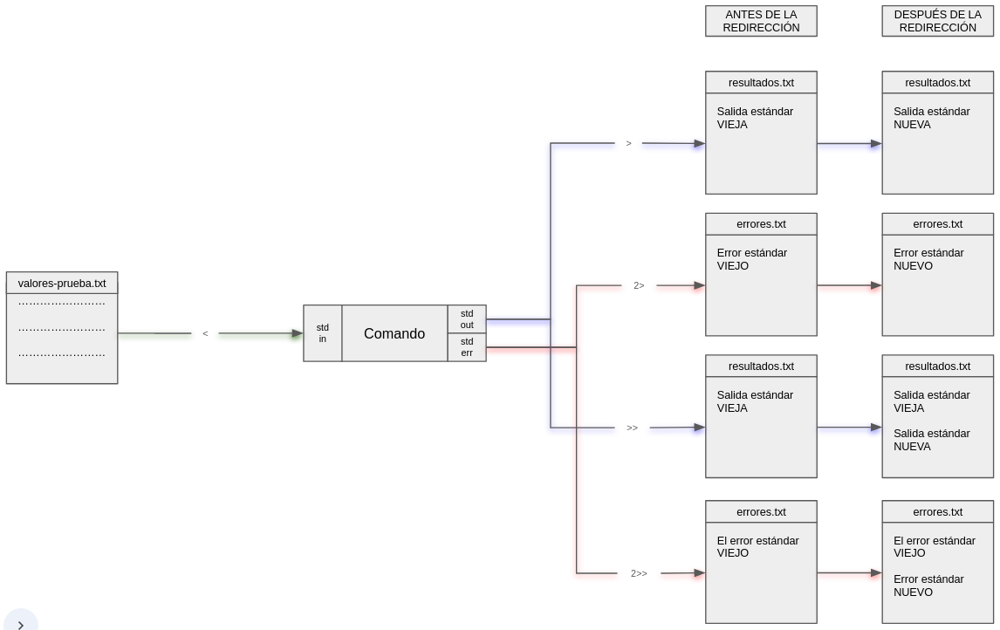

# Redirección y Pipes 

## Redirección {#_redirección}

### Comenzamos con una historia {#_comenzamos_con_una_historia}

Imaginemos lo siguiente:

En una cierta escuela, un profesor esté revisando trabajos y,
dependiendo de si el trabajo está bien hecho, los niños pueden ser
mandados a:

-   Un campo de juegos si tienen todo bien.

-   Un salón si hay un error en su trabajo.

Cuando se haga el trabajo bien lo representaremos con `>` o con `>>`;
cuando se haga mal lo representaremos con `2>` o con `2>>`

El profesor puede mandar a un niño a estudiar/jugar con sus compañeros
al lugar correspondiente o puede mandarlo a avisar a los demás que ya se
pueden ir, pero este niño debe quedarse.

Supongamos que Luis está bien, entonces cuando llega al campo de juegues
pueden pasar tres cosas:

1.  No es el primero en llegar y les dice a los demás compañeros que
    pueden irse pero él se queda ( `>` ).

2.  No es el primero en llegar y se queda con los demás compañeros (
    `>>` ).

3.  Es el primero en llegar ( `>` / `>>` ).

Ahora tenemos que Diego se equivocó, las alternativas son las mismas que
antes, solo que irá a un salón en vez del campo de juegos.

1.  No es el primero en llegar y les dice a los demás compañeros que
    pueden irse pero él se queda ( `2>` ).

2.  No es el primero en llegar y se queda con los demás compañeros (
    2\>\> `2>>` ).

3.  Es el primero en llegar ( `2>` / `2>>` ).

### Ahora seamos más técnicos {#_ahora_seamos_más_técnicos}

Cada proceso tiene al menos tres canales de comunicación.

-   Entrada estándar (STDIN)

-   Salida estándar (STDOUT)

-   Error estándar (STDERR)

Muchos comandos de UNIX aceptan su entrada desde STDIN y escriben su
salida a STDOUT. Esto permite enlazar comandos como si se tratara de
bloques de construcción.

El shell interpreta los símbolos `<`, `>` y `>>` como instrucciones de
redirigir las entradas desde algún archivo, al igual que las salidas.

Comportamiento de los operadores 

| <!----> | <!----> |
|:-------:|---------|
| `<` | Usa el contenido de un archivo como STDIN |
| `>` | Redirige STDOUT a un archivo, sustituye el contenido previo del archivo. |
| `>>` | Redirige STDOUT a un archivo, escribe al final del contenido previo del archivo. |
| `2>` | Redirige STDERR a un archivo |
| `2>>` | Redirige STDERR a un archivo, escribe al final del contenido previo del archivo. |


Uso de los operadores `<`, `>`, `>>` , `2>` y `2>>`.

``` shell
    comando < archivo-entrada
    comando > archivo-salida
    comando >> archivo-salida
    comando 2> archivo-error
    comando 2>> archivo-error
```



### Práctica {#_práctica}

Primero, obtengamos el material. **En tu home**, copia el directorio
**dia3** utilizando el siguiente comando:

``` shell
    cp -r /tmp/material-curso/dia3/redireccionYPipes .
```

Ahora realiza las siguientes actividades.

1.  Copia el contenido del archivo
    **red_pipes/poesia_artificial** al archivo
    **red_pipes/poesia_redireccionada** usando el comando **cat**.

2.  Usa el comando **ls** con un directorio que no exista, y guarda el
    mensaje de error en un archivo.

3.  Agrega la linea \"Esto es una copia de
    red_pipes/poesia_artificial\" al final del archivo
    **red_pipes/poesia_redireccionada** usando el comando **echo**.

## Pipes {#_pipes}

### Volvemos a comenzar con una historia {#_volvemos_a_comenzar_con_una_historia}

Un grupo de amigos se enfrenta a la siguiente tarea: necesitan realizar
una serie de operaciones. Son operaciones sencillas: suma, resta,
multiplicación, división; sin embargo, el número de operaciones que hay
que realizar es muy grande, lo que hace de esta tarea algo tedioso y
aburrido. Como no quieren dejar que solo uno de ellos sufra ni tener que
hacerlo todos, se les ocurre lo siguiente:

Cada uno de ellos realizará una operación y entonces les dirá al que
sigue: "Yo obtuve **este** resultado, ahora te toca a ti hacer **esta**
operación".

Así se formará una cadena de operaciones. Se irá pasando información de
uno a otro y se darán instrucciones acerca de qué hacer con esa
información.

El grupo de amigos hará esto hasta llegar a la última de las
operaciones, momento en que obtendrán el resultado.

De esta manera habrán logrado terminar una tarea que era muy aburrida,
de una manera muy sencilla.

Esto es lo que hace un pipe. Después de que un comando ejecuta una
acción, se obtiene información y esta información es pasada al siguiente
comando para que éste la utilice para trabajar.

### Volvamos a ser un poco más técnicos {#_volvamos_a_ser_un_poco_más_técnicos}

Para enviar la salida estándar de un comando como entrada estándar de
otro, usamos el símbolo pipe (|), de esta forma se pueden enlazar
tantos comandos como se desee.

Uso del operador |

``` shell
    comando1 | comando2 | comando3
```

La salida del comando1 es usada como entrada para el comando2 y la
salida del comando 2 es usada comoentrada para el comando3.

Ejemplo.

``` shell
    cat /proc/cpuinfo
    cat /proc/cpuinfo | head
```

#  filtrado

En linux trabajamos mucho con archivos de texto, debido a esto tenemos a
nuestra disposición una variedad de comandos que ayudan a filtrar la
información que se encuentra en este tipo de archivos.

## Obtengamos un poco de información de los archivos. {#_obtengamos_un_poco_de_información_de_los_archivos}

El comando **wc** cuenta líneas, palabras o caracteres dentro de un
archivo.

Opciones

| <!----> | <!----> |
|:-------:|---------|
| `-c` | Muestra el total de caracteres. |
| `-w` | Muestra el total de palabras.   |
| `-l` | Muestra el total de líneas.     |


### Práctica {#_práctica}

Para estas prácticas se utilizará el archivo datos.csv.

Muestra el total de líneas, palabras y caractéres dentro del archivo de
datos.

## ¿Cómo filtrar información? {#_cómo_filtrar_información}

**grep** es un comando de unix que nos permite filtrar líneas de un
archivo de texto, **grep** busca patrones de texto en cada línea y solo
muestra las líneas en las que encuentra el patrón.

Por lo general estos patrones son cadenas de texto pero no se limitan
solo a patrones de este tipo.

Forma de uso.

``` shell
    grep [opciones] patron [archivo]
    grep [opciones] [-e patron]... [-f archivo]... [archivo]
```

Algunas opciones de **grep**

| <!----> | <!----> |
|:-------:|---------|
| `-i` , `--ignore-case` | Ignora si las letras son mayúsculas o minúsculas. |
| `-v` , `--invert` | En lugar de mostrar las líneas que coinciden los patrones, muestra las líneas que no coinciden. |


### Prácticas {#_prácticas}

1.  Filtra las lineas del archivo de datos que copiaste para que solo
    muestre las lineas que contienen la palabra `Fire`.

2.  Muestra el total de lineas dentro del archivo de datos que contienen
    la palabra water.


```admonish success title="Respuesta"
Primero filtramos "water" en el archivo y lo pasamos al comando **wc**
con la opción **-l**
    
    grep water datos.csv | wc -l
```

## Head y Tail {#_head_y_tail}

**head** y **tail** son comandos que muestran solo las primeras y las
últimas líneas de un archivo respectivamente.

Opción importante

| <!----> | <!----> |
|:-------:|---------|
| `-n N` | Muestra **N** líneas. |

### Práctica {#_práctica_2}

1.  Muestra las líneas de la 5 a la 10 del archivo de datos.

2.  Muestra la penúltima línea del archivo de datos.

## Cut {#_cut}

**cut** es un comando que se usa en archivos que contienen diferentes
campos en cada línea, y nos permite mostrar solo los campos
seleccionados, para que **cut** funcione es necesario que los campos
estén separados por un carácter especifico.

Opciones importantes.

| <!----> | <!----> |
|:-------:|---------|
| `-d D` | De esta forma indicamos que **D** delimita los campos dentro del archivo. |
|`-f F` | De esta forma indicamos cuales son los campos que queremos mostrar. **F** es una lista de números. |

### Práctica {#_práctica_3}

Muestra el segundo y sexto campo de las primeras 10 líneas del archivo
de datos.
```admonish tip title="Pista"
Primero averigua qué carácter se usa para separar los campos en el
archivo mencionado.
```
```admonish success title="Respuesta"
De la siguiente manera podemos ve que se usan comas como separador de
campos:
    
    head -n 1 datos.csv

De modo que el ejercicio se resuelve de la siguiente manera.

    cut -d "," -f 2,6 datos.csv | head

```

## Sort {#_sort}

**sort** ordena las líneas de un archivo, para esto podemos indicar los
campos que se usaran para el ordenamiento y la forma en la que se
ordenarán.

Opciones de **sort**.

| <!----> | <!----> |
|:-------:|---------|
| `-k K` | **K** es la lista de campos usados en el ordenamiento. |
| `-t T` | **T** es el separador de campos.                       |
| `-n` | Ordena las líneas en orden numérico.                   |
| `-r` | Usa el orden inverso.                                  |

### Práctica {#_práctica_4}

-   Considerando el nombre de los pokémon, ordena los datos en orden
    alfábetico.

```admonish success title="Respuesta"
    sort -t ',' -k 2 datos.csv
```

-   Muestra la segunda columna por orden alfabético.

```admonish success title="Respuesta"
    tail -n 800 datos.csv | cut -d ',' -f 2 | sort
```

## Uniq

**uniq** permite eliminar líneas idénticas consecutivas dentro de un archivo., 
si se usa sin opciones las lineas repetidas se combinan en una sola linea.

Opciones de **uniq**

| <!----> | <!----> |
|:-------:|---------|
| `-c` | Muestra el número de veces que se repite cada línea.|
| `-d` | Muestra solo las líneas duplicadas.|
| `-u` | Muestra solo las líneas únicas.|

## Ejemplos prácticos {#_ejemplos_prácticos}

Utilizando el archivo **datos.csv**, obtener lo siguiente:

1.  ¿Cuál es el número de registros en el archivo?

2.  ¿Cuantos Pokemon legendarios hay?

3.  Obtener únicamente las columnas con el nombre de los Pokemon
    y su generación.

4.  ¿Qué tipo de Pokemon hay más? 

5.  Mostrar todas los tipos de los Pokemon (sin repetirlas).
<!---
6.  Mostrar qué personajes que no tiene la información de su editorial
    (mostrar columnas de personaje y editorial).

7.  Mostrar los personajes que sean mujeres y a la vez buenos (mostrar
    las columnas de nombre, genero y Alignment).

8.  Mostrar los personajes que sean mujeres y a la vez de la editorial
    Marvel Comics (mostrar las columnas de nombre, genero y editorial).

```admonish success title="Respuestas"
Número de personajes: 734

    wc -l heroes_information.csv

Número de mujeres

    grep -c Female heroes_information.csv
    grep Female heroes_information.csv | wc -l

Número de hombres

    grep -c Male heroes_information.csv
    grep Male heroes_information.csv | wc -l

Nombres y raza de personajes

    tail -n 734 heroes_information.csv | cut -d , -f 2,5

Editoriales de los personajes.

    tail -n 734 heroes_information.csv | cut -d , -f 8 | sort -u

Personaje sin editorial.

    tail -n 734 heroes_information.csv | cut -d , -f 2,8 | grep '""'

Cantidad de mujeres buenas

    cut -d , -f 2,3,10 heroes_information.csv | grep Female | grep good

Cantidad de mujeres de Marvel Comics

    cut -d , -f 2,3,8 heroes_information.csv | grep Female | grep "Marvel Comics"
```
--->
