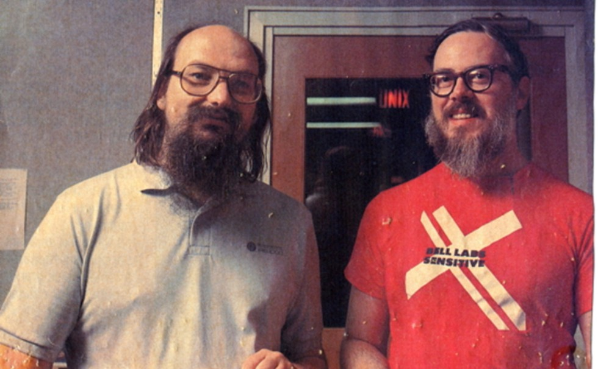
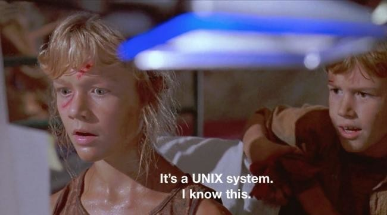
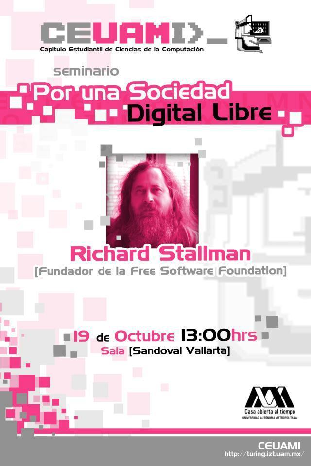
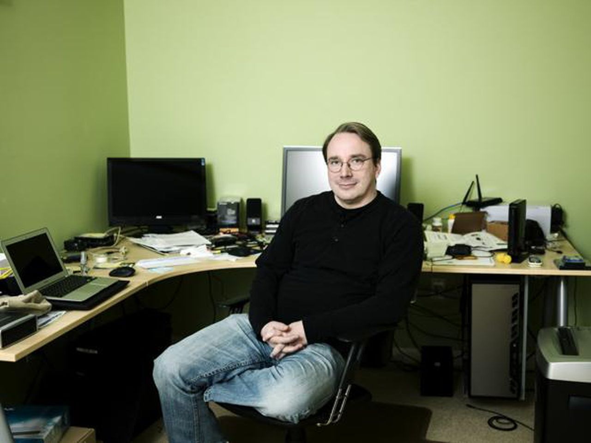

# Historia

## Historia del sistema operativo GNU/LINUX {#_historia_del_sistema_operativo_gnu_linux}

### UNIX {#_unix}

#### La cuna de UNIX: Los laboratorios Bell {#_la_cuna_de_unix_los_laboratorios_bell}

**Importante** compañía de investigación y desarrollo científico,fundada
en enero de 1925

Para enfatizar aún más la palabra importante:

[Algunos premios por trabajo realizada en los laboratorios Bell o por
gente que trabajó en
ellos](https://en.wikipedia.org/wiki/Bell_Labs#Nobel_Prize,_Turing_Award,_IEEE_Medal_of_Honor)

#### Ken thompson y Dennis Ritchie {#_ken_thompson_y_dennis_ritchie}

| <!----> | **Conicido, entre muchas otras cosas, por**|
|:-------:|--------------------------------------------|
| Ken Thompson | * Crear el lenguaje de programación B.     * Su trabajo en el desarrollo de Go.    * La computadora de ajedrez Belle.      * **Co-crear el sistema operativo UNIX** |
| Dennis Ritchie | * Crear el lenguaje de programación C.   * Co-escribir el libro *El lenguaje de programación C*.     * **Co-crear el sistema operativo UNIX** |

video::XvDZLjaCJuw\[youtube,start=198,end=314,lang=es,align=center\]

***Linea del tiempo de UNIX***

| **Año** | **Evento** |
|:-------:|------------|
| 1964    | Desarrollo de Multics |
| 1969        | Primera implementación de UNIX para [PDP-7](https://www.youtube.com/watch?v=pvaPaWyiuLA&t=1s) |
| 1970    | Unix fue implementado PDP-11 *En ensamblador* |
| 1971    | Primera edición oficial de UNIX |
| 1972    | Se escribe Unix *en C*          |
| 1975    | Sexta edición de UNIX  * La primera edición que se uso ampliamente fuera de AT&T   * licenciada para universidades a cambio de una cuota nominal por distribución.   * contenía: (* Documentación,   * **Código fuente del Kernel**)|
| 1982    | Ruptura del sistema Bell        |

### GNU {#_gnu}

GNU

**GNU is not UNIX**

#### Richard Stallman {#_richard_stallman}

Conocido entre muchas otras cosas por:

-   Fundar el movimiento del software libre

-   Fundar La [Free Software fundation](https://www.fsf.org)

-   Lanzar el proyecto GNU

-   Desarrollar GNU compiller collection

-   Escribir la GNU General Public License (GPL)

##### Las 4 libertades esenciales {#_las_4_libertades_esenciales}

-   Libertad 0: la libertad de usar el programa, con cualquier propósito
    (uso)

-   Libertad 1: la libertad de estudiar cómo funciona el programa y
    modificarlo, adaptándolo a las propias necesidades (estudio).

-   Libertad 2: la libertad de distribuir copias del programa, con lo
    cual se puede ayudar a otros usuarios (distribución).

-   Libertad 3: la libertad de mejorar el programa y hacer públicas esas
    mejoras a los demás, de modo que toda la comunidad se beneficie
    (mejora).

video::8SdPLG-\_wtA\[youtube,start=58,end=367,lang=es,align=center\]

Entre los programas más conocidos producidos por GNU están

 

| **Año** | **Evento** |
|:-------:|------------|
| 1984 | * Richard Stallman empieza a trabajar en un sistema UNIX libre,   * Inicia el proyecto [GNU](https://www.gnu.org/home.es.html) |
| 1985 | * Stallman funda la [FSF](https://www.fsf.org/),   * Desarrollo de la [licencia GPL](https://es.wikipedia.org/wiki/GNU_General_Public_License)|
| 1990 | * El proyecto GNU había producido un sistema operativo casi completo |

***Linea del tiempo de GNU***

### Linux {#_linux}

#### Linus Torvalds {#_linus_torvalds}

Conocido entre muchas otras cosas por:

-   **Ser el creador y desarrollador líder del Kernel Linux**

-   Ser el creador de git

**quote,Linus Torbalds, 5 de octubre de 1991**

¿Añoras los buenos días de minix 1.1, cuando los hombres eran hombres y escribían sus propios drivers?
¿no tienes ningún proyecto y te mueres por hincarle el diente a un sistema operativo que puedas intentar modificar para tus necesidades?
¿te empieza a parecer frustrante que todo funcione bien en minix?
¿no más noches en vela para hacer que un ingenioso programa funcione?
Entonces este post podría ser para ti :-)  ...

[correo](https://www.cs.cmu.edu/~awb/linux.history.html)

***Linea del tiempo linux***

| **Año** | **Evento** |
|:-------:|------------|
| 1991 | Linus torvalds solicita ayuda de otros programadores anunciando su kernel 0.02 en comp.os.minix |
| 1992 | la versión [0.12](https://mirrors.edge.kernel.org/pub/linux/kernel/Historic/old-versions/RELNOTES-0.12) empieza a utilizar la licencia gpl |

-   [tiene un desarrollo muy
    activo](https://git.kernel.org/pub/scm/linux/kernel/git/torvalds/linux.git/about/)

### GNU/LINUX {#_gnu_linux}

[Distribuciones](https://distrowatch.com/)

***Linea del timpo de GNU/LINUX***
| **Año** | **Evento** |
|:-------:|------------|
| 1992 | primera distribución de linux |
| 1993 | surge slackware, Suse, Redhat, Debian [link](https://upload.wikimedia.org/wikipedia/commons/1/1b/Linux_Distribution_Timeline.svg)|
| 2004 | aparece ubuntu |
| 2022 | CentOS 8 es descontinuado |

[Top500](https://www.top500.org/statistics/details/osfam/1)
