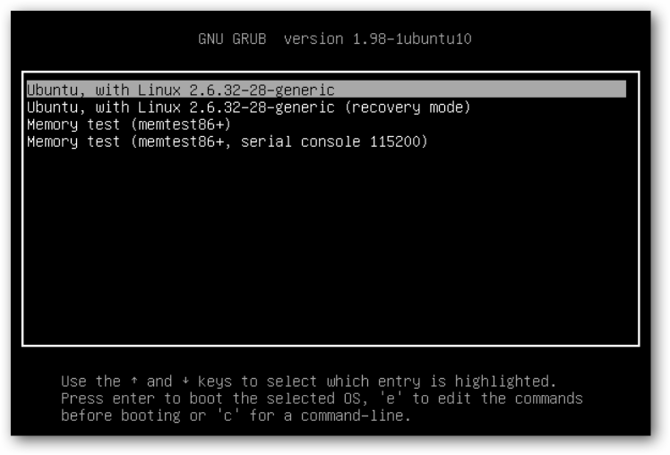
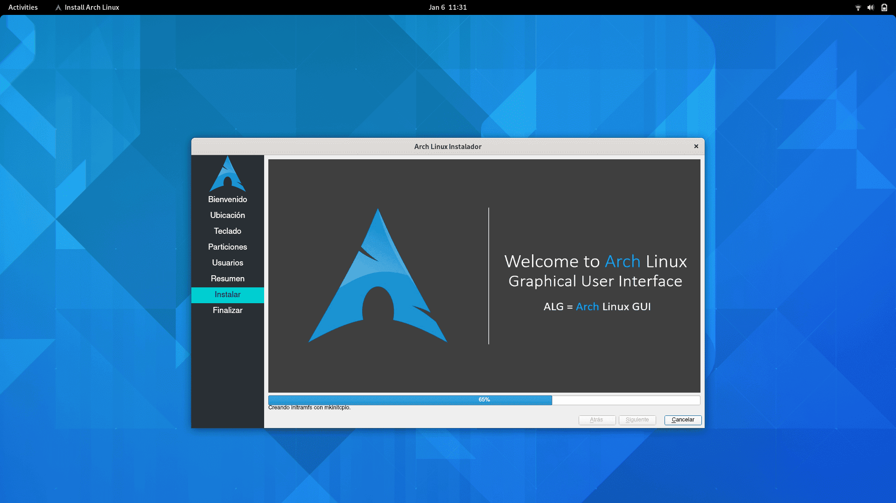

# Consejos de instalación
## ¿Por qué elegir Linux?
> "La herramienta correcta para la tarea correcta"

## Distros
[Distrowatch](https://distrowatch.com/?language=ES)
Distros interesantes
- [ubuntu](https://ubuntu.com)
- [MX Linux](https://mxlinux.org)
- [debian](https://www.debian.org/index.es.html)

- [Arch](https://archlinux.org)
- [EndeavourOS](https://endeavouros.com)
- [manjaro](https://manjaro.org)

- [RedHat](https://redhat.com)
- [Centos](https://centos.org)
- [Alma linux](https://centos.org)
- [Rocky linux](https://centos.org)

- [Puppy linux](https://puppylinux-woof-ce.github.io)
- [Gentoo](http://gentoo.org)
- [Alpine linux](alpinelinux.org)
- [HannaMontana linux](http://hannahmontana.sourceforge.net)

## Proceso de booteo
- Encendido
- BIOS/EFI
   - Unidad de booteo
- Cargador de arranque



- kernel

## Creación de unidad de arranque
-  ¿Qué es una tabla de particiones?
-  ¿Qué es una imagen ISO?
> Una copia o imagen exacta de un sistema de archivos.

```
dd if=/home/pepito/ubuntu-version-nuevisima.iso of=/dev/sdx
```

[Rufus](http://rufus.ie/es/)

## Particiones
- root
- home
- efi
- boot
- swap
- var
- tmp

## Proceso de instalación
- Bios
- Instalador gráfico


## Primeros pasos
- Actualización
- Drivers
- Localización

## Instalación dual con Windows
- Preparaciones en windows
- Secure boot
- Sistemas de archivos y distribuciones

## Windows subsystem for linux
[WSL](https://learn.microsoft.com/es-es/windows/wsl/install)
